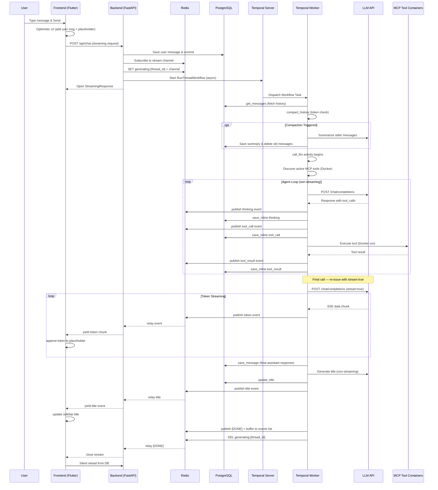

# ThreadBot Architecture & Design

This document provides a comprehensive overview of the ThreadBot system architecture, intended to help developers and AI agents understand how the components interact.

## System Overview

ThreadBot is a ChatGPT-like application that uses **Temporal** for orchestrating long-running LLM generation and database interactions. It consists of:

1.  **Frontend**: A Flutter Web application with a responsive, premium UI.
2.  **Backend API**: A FastAPI service that handles HTTP requests from the frontend and relays streaming events from Redis.
3.  **Temporal Worker**: A Python worker process that executes the actual workflows and activities.
4.  **Database**: PostgreSQL for storing threads, messages, and MCP server configurations.
5.  **Temporal Server**: The orchestration engine.
6.  **Redis**: Pub/sub message broker bridging the worker and backend for real-time streaming.
7.  **MCP Tool Servers**: Ephemeral containers (Docker or Kubernetes pods) that provide tools to the LLM via the Model Context Protocol. Auto-detected via `mcp_helper.py`.

```
    User → Frontend (Flutter Web)
    Frontend → Backend (FastAPI) via HTTP/REST
    Backend → PostgreSQL (Read/Write)
    Backend → Temporal Server (Submit Workflow)
    Backend ← Redis Pub/Sub (Subscribe to stream events)
    Temporal Server → Worker (Dispatch Task)
    Worker → PostgreSQL (Read/Write)
    Worker → LLM API (HTTP, streaming SSE)
    Worker → Redis Pub/Sub (Publish stream events)
    Worker → MCP Tool Containers (Docker exec)
```

The entire stack is containerized using Docker Compose (7 services: postgres, temporal, temporal-ui, redis, backend, worker, frontend).

---

## 1. Backend Architecture (Python / FastAPI)

The backend is split into the API server (`app/main.py` + `app/api/routes.py`) and the Temporal Worker (`app/worker.py`). Both share the same database models, schemas, and config.

### Configuration (`app/config.py`)
- Uses Pydantic v2 `BaseSettings`.
- Because Pydantic v2 models are frozen by default, runtime overrides (e.g., from the settings UI) are stored in a separate `_overrides` dictionary.
- On startup, `load_settings_from_db()` loads all persisted settings from the `settings` table into `_overrides`, so DB values take precedence over environment variables.
- The `PATCH /api/settings` endpoint writes to both `_overrides` (in-memory) and the `settings` table (DB), ensuring values survive restarts.
- Always use `get_setting("KEY")` or `get_llm_config()` rather than accessing the `Settings` object directly to ensure overrides are respected.
- `REDIS_URL` and `REDIS_DB` are configurable via environment variables. `get_redis_url()` returns the full connection string.

### Database (`app/database/`, `app/models/`)
- Uses **SQLAlchemy 2.0** with `asyncpg` for asynchronous database access.
- `expire_on_commit=False` and `autoflush=False` are set on the `async_sessionmaker`.
- **Models**:
    - `Thread`: Represents a conversation. Has a `parent_id` for branching (though the current UI focuses on linear threads).
    - `Message`: Belongs to a Thread. Contains `role` (user/assistant/thinking/tool_call/tool_result/system), `content`, and `metadata_` (JSONB).
    - `MCPServer`: Stores MCP server configurations (image, env vars, active status).
    - `Setting`: Simple key-value table for persisting runtime settings (LLM URL, model, API key, context params, etc.).
- **CRUD**: Located in `app/database/crud.py`. All functions are asynchronous and expect an `AsyncSession`. Note that the `Message` model's metadata column is named `metadata_` to avoid conflicts with SQLAlchemy's internal `metadata` attribute. Settings CRUD includes `get_all_settings` and `upsert_settings` for bulk read/write of key-value pairs.

### API Routes (`app/api/routes.py`)
- Standard REST endpoints for managing threads, messages, and settings.
- The `POST /api/chat` endpoint is the core of the application:
    1. It creates the user's message in the database in an isolated transaction.
    2. It subscribes to a per-request Redis pub/sub channel **before** starting the workflow (critical to avoid race conditions — Redis pub/sub doesn't buffer).
    3. It sets a `generating:{thread_id}` flag in Redis (with a 600s TTL) so the frontend can detect in-progress generation after a page refresh.
    4. It submits a Temporal workflow (`RunThreadWorkflow.run`) asynchronously using `start_workflow`.
    5. It returns a `StreamingResponse` that relays events from Redis to the frontend. Events are structured JSON. `[DONE]` and `[ERROR]` are plain string sentinels.
- The `GET /api/threads/{thread_id}/stream` endpoint supports **stream reconnect** after a page refresh:
    1. It checks the `generating:{thread_id}` Redis key to find the active channel. Returns 204 if not generating.
    2. It polls the Redis event buffer list (`events:{channel}`) using an index cursor, yielding all events from the beginning.
    3. New events are picked up on subsequent polls until `[DONE]` is encountered.
- The `GET /api/threads/{thread_id}` endpoint includes an `is_generating` boolean field by checking Redis.

### Temporal Workflows & Activities (`app/workflows/`, `app/activities/`)
- **Workflow** (`RunThreadWorkflow`): Orchestrates the chat process in this order:
    1. `get_messages` — fetch chat history, reconstructing OpenAI-compatible format
    2. `compact_history` — token-aware compaction check and summarization
    3. `call_llm` — LLM interaction loop with MCP tool support and real-time streaming
    4. `save_message` — persist final assistant response
    5. Auto-title — generate thread title (first exchange, then every 5th message)
    6. `publish_title` — send title to frontend via Redis
    7. `publish_done` — send `[DONE]` sentinel to close the stream
- **Activities** (8 registered):
    - `call_llm`: Agent loop with MCP tool support. Non-streaming calls during tool iterations (need full `tool_calls` JSON). Re-issues the final call with `stream: true` and publishes each SSE token to Redis as `{"type":"token","content":"..."}`. Saves intermediate messages (thinking, tool_call, tool_result) to DB inline as they happen. All events are also buffered in a Redis list (`events:{channel}`) for stream reconnect.
    - `compact_history`: Estimates tokens in history and uses the LLM to generate a summary of older messages if a threshold is exceeded.
    - `delete_messages_before`: Cleans up the database by removing messages that have been compacted into a summary.
    - `save_message`, `get_messages`, `update_title`: Interact with the database.
    - `publish_done`: Publishes `[DONE]` sentinel to Redis (both pub/sub and event buffer). Clears the `generating:{thread_id}` Redis key and sets a 60s TTL on the event buffer for reconnect grace period.
    - `publish_title`: Publishes `{"type":"title","content":"..."}` to Redis (both pub/sub and event buffer).
- **Crucial Rules**:
    1. **Explicit Workflow Inputs**: All configuration required by a workflow (such as LLM URLs, model names, API keys, Redis URL, and stream channel) MUST be provided explicitly as workflow input arguments. Activities should NOT rely on environment variables.
    2. **Temporal Sandbox**: Because Temporal executes activities in an isolated sandbox, database imports must happen inside the activity function bodies, not at the module level.

### MCP & Tool Orchestration
ThreadBot supports extending the LLM with custom tools via the Model Context Protocol (MCP).
- **Discovery**: The `call_llm` activity queries all active `MCPServer` entries in the database. For each server, it uses a temporary `stdio_client` connection to discover tool definitions. The connection method is auto-detected by `mcp_helper.py`: Docker locally (`docker run -i`), or `kubectl run` pods in Kubernetes.
- **Networking**: In Docker, tool containers are launched with `--add-host=host.docker.internal:host-gateway` to allow them to reach services on the host machine. In Kubernetes, MCP pods run in the same namespace with RBAC permissions via the `threadbot-sa` ServiceAccount.
- **Execution**: If the LLM requests a tool call, the worker launches the corresponding container/pod, executes the tool, and feeds the result back into the LLM context. Fresh `StdioServerParameters` are generated per execution to avoid pod name collisions.
- **Persistence**: Unlike standard tool loops, ThreadBot persists every `tool_call` and `tool_result` to the database as unique message roles. This ensures the LLM retains "tool memory" across turns and allows for visual reconstruction in the UI.
- **Agent Loop**: Capped at `max_iterations` (default 25). A system prompt is injected when tools are available to encourage multi-step tool use.
- **Infrastructure Requirements**: The `backend` and `worker` containers must have the `docker` CLI installed (Docker Compose) or `kubectl` (Kubernetes). In K8s, the `threadbot-sa` ServiceAccount needs RBAC permissions for pods, pods/attach, and pods/log.

### Conversational Compaction & Memory
To manage large conversations and stay within LLM context limits, ThreadBot implements **Token-Aware Compaction**:
- **Monitoring**: Before every LLM call, history is analyzed using a character-count heuristic (`chars / 4`).
- **Thresholds**: If tokens exceed a configurable percentage of the `context_window`, a compaction event triggers.
- **Summarization**: Older messages (excluding a small "preserve recent" buffer) are sent to a separate non-streaming LLM call for summarization.
- **Replacement**: The original messages are deleted from the database and replaced with a single `system` role message containing the summary. This summary is then provided to the LLM as the first message in subsequent turns.

---

## 2. Real-Time Streaming Architecture

Streaming is the core UX feature. Here's why Redis pub/sub is used and how it works:

### Why Redis is Required
The Temporal worker (where `call_llm` executes) and the backend (where the HTTP streaming response lives) are **separate processes/containers**. Temporal workflows/activities don't support streaming results back to the caller — they return values only when complete. Redis bridges this gap with:
- **Pub/sub channels**: Real-time event relay from worker to backend for the initial SSE connection.
- **Event buffer lists**: A Redis list (`events:{channel}`) stores all events for stream reconnect after page refresh. The list is polled by the reconnect endpoint.
- **Generating status**: A Redis key (`generating:{thread_id}`) tracks which threads have active generation so the frontend knows to reconnect.

### Event Flow
```
LLM API --SSE tokens--> Worker (call_llm activity)
                            |
                            | publish() to Redis channel + event buffer list
                            v
                    Redis Pub/Sub Channel ──────── Redis List (events:{channel})
                            |                              |
                            | subscribe (live connection)  | LRANGE (reconnect)
                            v                              v
                    Backend (StreamingResponse)     Backend (reconnect endpoint)
                            |                              |
                            | HTTP chunked response        | HTTP chunked response
                            v                              v
                    Frontend (initial send)         Frontend (page refresh)
```

### Structured JSON Events
All events are JSON objects published to a per-request Redis channel:

| Type | Payload | When |
|------|---------|------|
| `thinking` | `{"type":"thinking","content":"..."}` | LLM returns content alongside tool_calls |
| `tool_call` | `{"type":"tool_call","content":"Calling ...","tools":["..."]}` | LLM requests tool execution |
| `tool_result` | `{"type":"tool_result","tool":"...","content":"...","success":bool}` | Tool execution completes |
| `token` | `{"type":"token","content":"<chunk>"}` | Each SSE token from the final streaming LLM call |
| `title` | `{"type":"title","content":"..."}` | Auto-generated thread title |
| `text` | `{"type":"text","content":"..."}` | Fallback for non-streaming responses |
| `[DONE]` | Plain string sentinel | Stream complete, safe to reload from DB |
| `[ERROR]` | Plain string sentinel | Error occurred |

### Token Streaming Details
- During the agent loop, tool iterations use **non-streaming** calls to get the full `tool_calls` JSON structure in one response.
- When the final iteration returns text-only (no tool calls), the activity re-issues the same request with `stream: true`.
- SSE `data:` lines are parsed, `choices[0].delta.content` tokens are extracted and published individually to Redis.
- If the streaming call fails, the activity falls back to the non-streaming response already received.
- The frontend appends each token to a placeholder assistant message, and the markdown renderer progressively displays the growing text.

---

## 3. Frontend Architecture (Flutter)

The frontend is a Flutter Web application designed to look and feel like a premium AI chat interface.

### State Management
- State is managed locally within `StatefulWidget`s (e.g., `ChatScreen`).
- No global state management libraries (like Provider or Riverpod) are used to keep the architecture simple and avoid issues with Dart's tree-shaking.
- `Message.content` and `ThreadListItem.title` are mutable fields to support in-place streaming updates without object replacement.

### API Communication (`lib/services/api_service.dart`)
- Handles all HTTP communication with the FastAPI backend.
- Settings (LLM URL, model, API key, context params) are loaded from and saved to the backend API exclusively. No local storage is used for settings.

### UI Components (`lib/screens/`, `lib/widgets/`)
- `ChatScreen`: The main layout containing the sidebar and the chat area. Handles message sending, structured JSON event parsing, token streaming, and placeholder management.
- `Sidebar`: Displays a date-grouped list of threads. Shows "Generating title..." with a spinner for threads titled "New Thread", updates instantly when a `title` event arrives.
- `ChatMessageList`: Renders the conversation using `flutter_markdown`. It uses a routing system to display different message roles:
    - **User/Assistant**: Standard chat bubbles with distinct, color-coded, uppercase labels ("YOU" / "THREADBOT").
    - **Thinking**: Collapsible amber blocks (inline within assistant bubbles, or standalone during streaming).
    - **Tool Call**: Styled purple chips showing the server and tool name. Each chip has its own pulse animation that stops when its result arrives. Chips show a loading spinner while waiting for results. Expandable sections show tool input (JSON arguments) and output.
    - **Tool Result**: Collapsible monospace code blocks for raw tool output, with green check / red X status icons.
    - **Compaction Summary**: Subtle divider labels indicating that earlier messages have been summarized.
    - **Skeleton Shimmer**: Paragraph-sized animated gradient bars shown while waiting for the first token.
- `ChatInput`: A custom input field that handles multi-line text and "Enter to send" behavior.

### Placeholder & Streaming Flow
1. User sends a message -> frontend creates a `temp-ast-*` placeholder assistant message (empty content, shows skeleton shimmer under THREADBOT header).
2. Intermediate events (thinking, tool_call, tool_result) are inserted **before** the placeholder in the message list.
3. `token` events append content to the placeholder progressively — shimmer disappears on first token.
4. `title` events update the sidebar thread title in-place.
5. On `[DONE]`, a silent DB reload replaces all temp messages with persisted ones.

### Stream Reconnect Flow
If the page is refreshed mid-generation:
1. `_loadThread` fetches messages from DB. The `ThreadResponse` includes `is_generating: true`.
2. Frontend calls `_reconnectToStream`: clears non-user/system messages, adds a placeholder assistant message, sets `_isSending = true`.
3. Connects to `GET /api/threads/{id}/stream` which polls the Redis event buffer list.
4. All buffered events replay from the beginning via `_processStreamChunks` (shared with `_sendMessage`), rebuilding thinking/tool_call/tool_result bubbles and streaming tokens.
5. New events continue to arrive via polling until `[DONE]`.
6. On `[DONE]`, standard silent DB reload and `_isSending = false`.

---

## 4. Data Flow: Sending a Message



1.  **User action**: The user types a message and presses Enter in `ChatInput`.
2.  **Frontend Optimistic Update**: `ChatScreen` immediately adds the user's message and a placeholder assistant message (empty content, shows skeleton shimmer) to the local list and scrolls to the bottom.
3.  **API Request**: `ApiService.sendMessageStream` sends a `POST /api/chat` request containing the content and optional thread ID. LLM configuration is managed entirely server-side.
4.  **Backend Setup**: `chat_endpoint` creates the message in DB, subscribes to the Redis channel, sets the `generating:{thread_id}` flag in Redis, starts the workflow, and opens a `StreamingResponse` that relays Redis events.
5.  **Agent Loop**: The worker executes `call_llm` with non-streaming calls during tool iterations. Intermediate messages (thinking, tool_call, tool_result) are saved to DB inline and published to Redis (both pub/sub and event buffer list) in real-time.
6.  **Token Streaming**: When the agent loop's final iteration returns text (no tool calls), `call_llm` re-issues the request with `stream: true`. Each SSE token is published to Redis → relayed by backend → appended to the placeholder by the frontend.
7.  **Title Generation**: After saving the final response, the workflow generates a title, saves it, and publishes a `title` event to Redis so the sidebar updates instantly.
8.  **Finalization**: `publish_done` sends `[DONE]` to close the stream, buffers it in the events list, and clears the `generating:{thread_id}` Redis key. The event buffer list TTL is set to 60s for reconnect grace period. The frontend does a silent DB reload to replace temp messages with persisted ones.

---

## 5. Docker & Infrastructure

- Defined in `docker-compose.yml`.
- **Services** (7):
    - `postgres`: The database.
    - `temporal`: The Temporal server (auto-setup image).
    - `temporal-ui`: The Temporal Web UI.
    - `redis`: Redis 7 for pub/sub streaming.
    - `backend`: The FastAPI server.
    - `worker`: The Temporal worker process.
    - `frontend`: Nginx serving the compiled Flutter Web application, with reverse proxy to backend for `/api/` and `/health`.
- **Startup Dependencies**: The `backend` and `worker` services use `depends_on` with `condition: service_healthy` to wait for Postgres, Temporal, and Redis to be ready. They also have `restart: on-failure` to handle any race conditions during initialization.

## 6. Development Guidelines

- **Simplicity First**: Avoid over-engineering. If a simple `setState` works in Flutter, use it instead of a complex state management system.
- **Temporal Sandbox**: Always remember that Temporal activities run in restricted environments. Avoid module-level state and perform lazy imports for database connections.
- **Config Overrides**: Always use the override-aware helper functions (`get_setting`, `get_llm_config`) in the backend, as Pydantic models are immutable. Settings are persisted in the DB `settings` table and loaded on startup via `load_settings_from_db()`.
- **Redis is Required**: Redis pub/sub cannot be replaced with in-memory queues because the worker and backend are separate processes. With K8s multi-replica deployments, in-memory approaches fail when the request handler and worker activity land on different pods. Redis also serves as the event buffer store for stream reconnect (events lists) and generation status tracking (generating keys).
