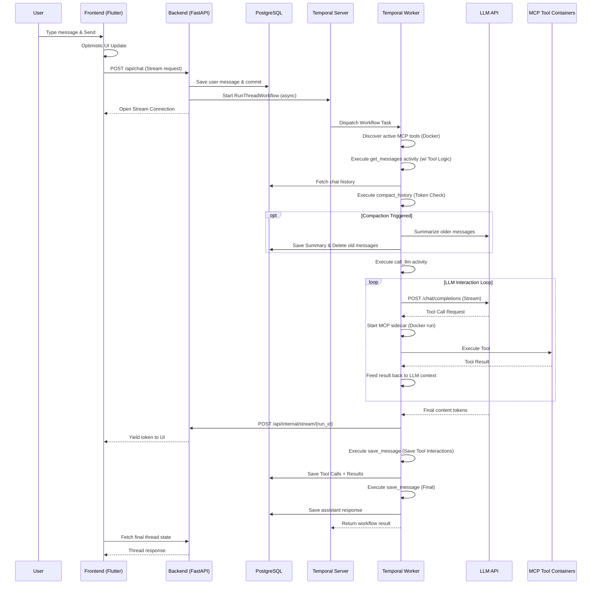

# ThreadBot Architecture & Design

This document provides a comprehensive overview of the ThreadBot system architecture, intended to help developers and AI agents understand how the components interact.

## System Overview

ThreadBot is a ChatGPT-like application that uses **Temporal** for orchestrating long-running LLM generation and database interactions. It consists of:

1.  **Frontend**: A Flutter Web application with a responsive, premium UI.
2.  **Backend API**: A FastAPI service that handles HTTP requests from the frontend and submits workflows to Temporal.
3.  **Temporal Worker**: A Python worker process that executes the actual workflows and activities.
4.  **Database**: PostgreSQL for storing threads, messages, and MCP server configurations.
5.  **Temporal Server**: The orchestration engine.
6.  **MCP Tool Servers**: Ephemeral Docker containers that provide tools to the LLM via the Model Context Protocol.

    User([User]) -->|Interact| Frontend[Flutter Web Frontend]
    Frontend -->|HTTP/REST| Backend[FastAPI Backend]
    Backend -->|Read/Write| DB[(PostgreSQL)]
    Backend -->|Submit Workflow| Temporal[Temporal Server]
    Temporal -->|Dispatch Task| Worker[Python Temporal Worker]
    Worker -->|Read/Write| DB
    Worker -->|HTTP| LLM[LLM API e.g. Ollama]
    Worker -->|Docker Exec| MCP[MCP Tool Containers]
    MCP -->|Tools| Worker
```

The entire stack is containerized using Docker Compose.

---

## 1. Backend Architecture (Python / FastAPI)

The backend is split into the API server (`app/main.py` + `app/api/routes.py`) and the Temporal Worker (`app/worker.py`). Both share the same database models, schemas, and config.

### Configuration (`app/config.py`)
- Uses Pydantic v2 `BaseSettings`.
- Because Pydantic v2 models are frozen by default, runtime overrides (e.g., from the settings UI) are stored in a separate `_overrides` dictionary.
- Always use `get_setting("KEY")` or `get_llm_config()` rather than accessing the `Settings` object directly to ensure overrides are respected.

### Database (`app/database/`, `app/models/`)
- Uses **SQLAlchemy 2.0** with `asyncpg` for asynchronous database access.
- `expire_on_commit=False` and `autoflush=False` are set on the `async_sessionmaker`.
- **Models**:
    - `Thread`: Represents a conversation. Has a `parent_id` for branching (though the current UI focuses on linear threads).
    - `Message`: Belongs to a Thread. Contains `role` (user/assistant), `content`, and `metadata_` (JSONB).
- **CRUD**: Located in `app/database/crud.py`. All functions are asynchronous and expect an `AsyncSession`. Note that the `Message` model's metadata column is named `metadata_` to avoid conflicts with SQLAlchemy's internal `metadata` attribute.

### API Routes (`app/api/routes.py`)
- Standard REST endpoints for managing threads, messages, and settings.
- The `POST /api/chat` endpoint is the core of the application:
    1. It creates the user's message in the database in an isolated transaction.
    2. It submits a Temporal workflow (`RunThreadWorkflow.run`) asynchronously using `start_workflow`.
    3. It immediately returns a `StreamingResponse` to the frontend, pulling from an `asyncio.Queue` that is fed by the worker in real-time.

### Temporal Workflows & Activities (`app/workflows/`, `app/activities/`)
- **Workflow** (`RunThreadWorkflow`): Orchestrates the chat process.
    - Gets chat history (reconstructing OpenAI-compatible format from persisted tool messages).
    - Checks for Conversational Compaction (summarizes history if nearing context limits).
    - Calls the LLM (with discovery and execution of MCP tools).
    - Updates the thread title (if it's the first message or periodic update).
    - Saves all intermediate tool messages (calls and results).
    - Saves the final assistant's response.
- **Activities**:
    - `call_llm`: Makes an HTTP request to the LLM API, streams tokens, and handles the MCP tool interaction loop. Returns a structured dictionary containing the final content and all intermediate tool interactions.
    - `compact_history`: Estimates tokens in history and uses the LLM to generate a summary of older messages if a threshold is exceeded.
    - `delete_messages_before`: Cleans up the database by removing messages that have been compacted into a summary.
    - `save_message`, `get_messages`, `update_title`: Interact with the database.
- **Crucial Rules**:
    1. **Explicit Workflow Inputs**: All configuration required by a workflow (such as LLM URLs, model names, and API keys) MUST be provided explicitly as workflow input arguments. Activities should NOT rely on environment variables.
    2. **Temporal Sandbox**: Because Temporal executes activities in an isolated sandbox, database imports must happen inside the activity function bodies, not at the module level.

### MCP & Tool Orchestration
ThreadBot supports extending the LLM with custom tools via the Model Context Protocol (MCP).
- **Discovery**: The `call_llm` activity queries all active `MCPServer` entries in the database. For each server, it uses a temporary `stdio_client` connection to a `docker run -i` process to fetch tool definitions.
- **Networking**: Tool containers are launched with `--add-host=host.docker.internal:host-gateway` to allow them to reach services on the host machine.
- **Execution**: If the LLM requests a tool call, the worker launches the corresponding Docker container, executes the tool, and feeds the result back into the LLM context.
- **Persistence**: Unlike standard tool loops, ThreadBot persists every `tool_call` and `tool_result` to the database as unique message roles. This ensures the LLM retains "tool memory" across turns and allowed for visual reconstruction in the UI.
- **Infrastructure Requirements**: The `backend` and `worker` containers must have the `docker` CLI installed and `/var/run/docker.sock` mounted from the host.

### Conversational Compaction & Memory
To manage large conversations and stay within LLM context limits, ThreadBot implements **Token-Aware Compaction**:
- **Monitoring**: Before every LLM call, history is analyzed using a character-count heuristic (`chars / 4`).
- **Thresholds**: If tokens exceed a configurable percentage of the `context_window`, a compaction event triggers.
- **Summarization**: Older messages (excluding a small "preserve recent" buffer) are sent to a separate non-streaming LLM call for summarization.
- **Replacement**: The original messages are deleted from the database and replaced with a single `system` role message containing the summary. This summary is then provided to the LLM as the first message in subsequent turns.

---

## 2. Frontend Architecture (Flutter)

The frontend is a Flutter Web application designed to look and feel like a premium AI chat interface.

### State Management
- State is managed locally within `StatefulWidget`s (e.g., `ChatScreen`).
- No global state management libraries (like Provider or Riverpod) are used to keep the architecture simple and avoid issues with Dart's tree-shaking.

### API Communication (`lib/services/api_service.dart`)
- Handles all HTTP communication with the FastAPI backend.
- Manages LLM settings persistence using `shared_preferences`. It reads from local storage and falls back to backend defaults.

### UI Components (`lib/screens/`, `lib/widgets/`)
- `ChatScreen`: The main layout containing the sidebar and the chat area. Handles message sending, optimistic UI updates, and loading states.
- `Sidebar`: Displays a date-grouped list of threads and handles thread selection, creation, renaming, and deletion.
- `ChatMessageList`: Renders the conversation using `flutter_markdown`. It uses a routing system to display different message roles:
    - **User/Assistant**: Standard chat bubbles with distinct, color-coded, uppercase labels ("YOU" / "THREADBOT").
    - **Tool Call**: Styled purple chips showing the server and tool name being invoked.
    - **Tool Result**: Collapsible monospace code blocks for raw tool output.
    - **Compaction Summary**: Subtle divider labels indicating that earlier messages have been summarized.
- `ChatInput`: A custom input field that handles multi-line text and "Enter to send" behavior.

---

## 3. Data Flow: Sending a Message



1.  **User action**: The user types a message and presses Enter in `ChatInput`.
2.  **Frontend Optimistic Update**: `ChatScreen` immediately adds the user's message to the local list and scrolls to the bottom.
3.  **API Request**: `ApiService.sendMessageStream` sends a `POST /api/chat` request containing the content and any LLM config overrides.
4.  **Backend Setup**: `chat_endpoint` in FastAPI creates the message in the database, starts `RunThreadWorkflow` asynchronously, and immediately opens a `StreamingResponse` to the client.
5.  **Temporal Orchestration & Title Gen**:
    - Worker executes `get_messages` activity.
    - If it's a new thread, it executes a separate LLM call to generate a very short, strict title.
6.  **Streaming Phase**:
    - Worker executes `call_llm` activity (making the HTTP stream call to Ollama).
    - As each token arrives, the worker POSTs it to the FastAPI internal proxy endpoint.
    - FastAPI yields the token through the open `StreamingResponse` connection.
    - The Flutter UI receives the chunks and updates the interface in real-time.
7.  **Finalization**: The worker executes `save_message` activity to store the full LLM's response. The frontend makes a final fetch to get the updated database IDs and the generated title.

---


## 4. Docker & Infrastructure

- Defined in `docker-compose.yml`.
- **Services**:
    - `postgres`: The database.
    - `temporal`: The Temporal server (auto-setup image).
    - `temporal-ui`: The Temporal Web UI.
    - `backend`: The FastAPI server.
    - `worker`: The Temporal worker process.
    - `frontend`: Nginx serving the compiled Flutter Web application.
- **Startup Dependencies**: The `backend` and `worker` services use `depends_on` with `condition: service_healthy` to wait for Postgres and Temporal to be ready. They also have `restart: on-failure` to handle any race conditions during initialization.

## 5. Development Guidelines

- **Simplicity First**: Avoid over-engineering. If a simple `setState` works in Flutter, use it instead of a complex state management system.
- **Temporal Sandbox**: Always remember that Temporal activities run in restricted environments. Avoid module-level state and perform lazy imports for database connections.
- **Config Overrides**: Always use the override-aware helper functions (`get_setting`, `get_llm_config`) in the backend, as Pydantic models are immutable.
