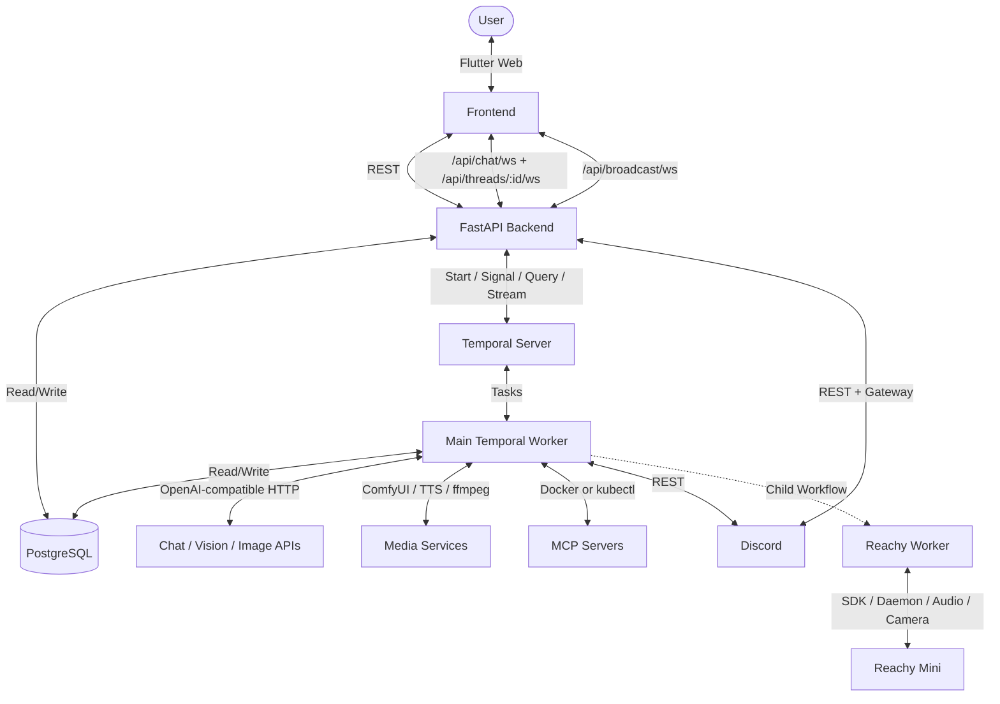
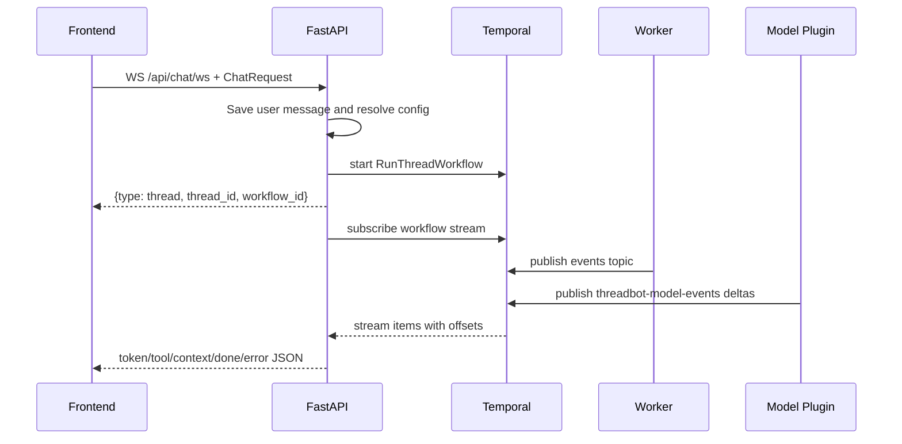

# ThreadBot Architecture & Design

This document describes the current ThreadBot implementation. It is intended for developers and coding agents who need to understand how the system fits together before changing it.

## System Overview

ThreadBot is a threaded AI chat application built around Temporal durable execution. The current stack is:

- **Flutter Web frontend** for chat, thread navigation, MCP management, settings, Discord controls, Reachy binding, image upload, and streaming display.
- **FastAPI backend** for REST APIs, WebSocket streaming, schema bootstrapping, DB-backed runtime settings, Discord background tasks, and Temporal client access.
- **Main Temporal worker** for chat workflows, Discord indexing, model/tool/media activities, MCP execution, title generation, and context compaction.
- **PostgreSQL** for all durable app state.
- **Temporal Server** for workflow orchestration and model-call/plugin execution.
- **MCP tool containers/pods** for runtime-extensible tools.
- **Optional Discord integration** through the Discord REST API and `discord.py` gateway bot.
- **Optional Reachy Mini integration** through a local daemon, local Temporal worker, and voice bridge on the robot host.

Redis is not part of the current Compose stack. Earlier versions used Redis pub/sub for SSE streaming; current streaming uses Temporal workflow streams and WebSockets.



## Repository Structure

```text
docker-compose.yml                 Core app services plus optional reachy profile
deploy.sh                          Interactive Kubernetes deployment helper
run-reachy.sh                      Helper to start/stop/restart Reachy profile services
backend/
  app/main.py                      FastAPI app, startup, Temporal client/plugin, Discord tasks
  app/api/routes.py                REST and WebSocket API routes
  app/worker.py                    Main Temporal worker
  app/config.py                    Pydantic settings, DB overrides, config helpers
  app/temporal_client.py           Temporal connection, optional AES-GCM payload codec
  app/agents_provider.py           OpenAI Agents SDK model provider setup
  app/workflows/thread_workflow.py Main chat workflow
  app/workflows/discord_index_workflow.py Discord history indexing workflow
  app/workflows/reachy_speech_workflow.py Reachy child speech workflow
  app/activities/llm_activities.py Main activities and built-in tools
  app/activities/reachy_activities.py Local Reachy worker activities
  app/discord_integration.py       Discord REST/polling/sync helpers
  app/discord_bot.py               Discord slash command and mention bot
  app/reachy_bridge.py             Local voice/typed Reachy bridge
  app/reachy_worker.py             Local Reachy Temporal worker
  app/reachy_client.py             Reachy SDK/daemon/camera/audio helper layer
  app/models/                      SQLAlchemy and Pydantic models
  app/database/                    Async engine/session, schema bootstrap, CRUD
  app/assets/                      Bundled ComfyUI workflows
frontend/
  lib/main.dart                    Flutter app entry and theme
  lib/services/api_service.dart    REST and WebSocket client
  lib/screens/chat_screen.dart     Main chat screen and integration controls
  lib/screens/settings_screen.dart Settings UI
  lib/screens/mcp_screen.dart      MCP server management UI
  lib/widgets/                     Chat rendering, sidebar, input, avatar
docs/reachy-compose.md             Reachy profile docs
scripts/reachy/                    Platform install scripts for local Reachy host
k8s/                               Kubernetes manifests
```

## Backend Startup

`app/main.py` uses a FastAPI lifespan hook:

1. Calls `ensure_database_schema()` to create tables and apply additive DDL for persisted deployments.
2. Calls `load_settings_from_db()` so rows in `settings` override environment defaults.
3. Builds an OpenAI Agents SDK `OpenAIAgentsPlugin` with the current LLM config.
4. Connects a Temporal client using `connect_temporal_client()`.
5. Stores the client for API routes with `set_temporal_client()`.
6. Starts Discord background tasks: `discord_poll_loop(client)` and `run_discord_bot(client)`.

The backend exposes `/health` and includes the API router under `/api`.

## Configuration

`app/config.py` is the configuration source of truth.

- `Settings` defines environment/default values.
- `_overrides` holds DB-loaded runtime settings because settings are not mutated directly.
- `load_settings_from_db()` loads the `settings` table and coerces known values back to booleans, numbers, lists, and JSON.
- `get_setting()` checks `_overrides` first, then `Settings`.
- `get_llm_config()` returns the runtime config passed into workflows.
- `get_discord_config()` and `get_reachy_config()` return optional integration config.
- `apply_thread_llm_overrides()` merges allowed per-thread overrides into a copy of `llm_config`.

Important setting families:

- Chat model: `LLM_PROVIDER`, `LLM_API_URL`, `LLM_API_KEY`, `LLM_MODEL`, `LLM_TEMPERATURE`, `LLM_MAX_TOKENS`, `LLM_MAX_ITERATIONS`.
- Context: `LLM_CONTEXT_WINDOW`, `LLM_COMPACTION_THRESHOLD`, `LLM_PRESERVE_RECENT`, `LLM_TOOL_RESULT_MAX_CHARS`.
- Vision/image: `LLM_VISION_*`, `LLM_IMAGE_*`, `LLM_COMFYUI_*`.
- Video/audio/TTS/lip-sync: `LLM_VIDEO_*`, `LLM_AUDIO_*`, `LLM_TTS_*`, `LLM_COMFYUI_VIDEO_*`, `LLM_COMFYUI_LIPSYNC_*`.
- Discord: `DISCORD_ENABLED`, `DISCORD_BOT_TOKEN`, `DISCORD_GUILD_ID`, `DISCORD_CHANNEL_ID`, `DISCORD_POLL_INTERVAL_SECONDS`.
- Reachy: `REACHY_ENABLED`, `REACHY_THREAD_ID`, `REACHY_WAKE_WORD`, `REACHY_DAEMON_URL`, `REACHY_TASK_QUEUE`, `REACHY_SPEECH_ENABLED`, `REACHY_OUTPUT_VOLUME`, `REACHY_RESPONSE_MOOD`.

Per-thread LLM overrides are stored on `threads.llm_overrides` and limited to `THREAD_OVERRIDABLE_KEYS`.

## Database Model

The app uses SQLAlchemy 2.0 async with `asyncpg`. `expire_on_commit=False` and `autoflush=False` are used. Prefer explicit queries and `selectinload`; avoid relying on lazy loads after commits.

Core tables:

| Table | Purpose |
| --- | --- |
| `threads` | Conversation threads. Includes `parent_id` for branching and `llm_overrides` for per-thread model/tool/media settings. |
| `messages` | Thread messages. Roles include `user`, `assistant`, `thinking`, `tool_call`, `tool_result`, and `system`. Uses JSONB `metadata`. |
| `settings` | Persisted runtime settings as key/value rows. |
| `generated_images` | Stored image bytes for uploads, generated images, Discord copied attachments, and Reachy camera captures. |
| `generated_media` | Stored generated video/audio media bytes. |
| `mcp_servers` | MCP server config, encrypted env vars/args/registry credentials, active flag, cached tools, cache timestamp. |
| `thread_tool_overrides` | Per-thread MCP server/tool enablement overrides. |
| `discord_thread_links` | Links ThreadBot threads to Discord threads and stores indexing state/cursors. |
| `discord_servers` | Discord guild metadata discovered from integration use. |
| `discord_server_tool_overrides` | MCP server/tool overrides applied to Discord-originated turns for a guild. |

`ensure_database_schema()` in `app/database/__init__.py` is the additive schema compatibility layer until a migration framework exists. It creates missing tables and adds newer columns such as `llm_overrides`, `registry_credentials`, `cached_tools_at`, generated media tables, and Discord tables.

## API Surface

`app/api/routes.py` exposes the current API.

Chat and streaming:

- `POST /api/chat` returns HTTP 426 because chat streaming now uses WebSockets.
- `WS /api/chat/ws` starts a chat turn and streams workflow events.
- `WS /api/threads/{thread_id}/ws` reconnects to a running workflow stream for an existing thread.
- `WS /api/broadcast/ws` broadcasts thread-list updates to connected clients.
- `POST /api/threads/{thread_id}/continue` signals `RunThreadWorkflow.respond_continue`.

Threads and messages:

- `POST /api/threads`
- `GET /api/threads`
- `GET /api/threads/{thread_id}`
- `GET /api/threads/{thread_id}/replies`
- `PATCH /api/threads/{thread_id}`
- `DELETE /api/threads/{thread_id}`
- `DELETE /api/threads`

Media:

- `GET /api/generated-images/{filename}` serves file-backed or DB-backed images.
- `GET /api/generated-media/{filename}` serves file-backed or DB-backed media.
- `POST /api/uploads/images` stores user-uploaded images and returns `/api/generated-images/...` URLs.

Settings and overrides:

- `GET /api/settings`
- `PATCH /api/settings`
- `GET /api/threads/{thread_id}/llm-overrides`
- `PUT /api/threads/{thread_id}/llm-overrides`
- `DELETE /api/threads/{thread_id}/llm-overrides`
- `GET /api/threads/{thread_id}/tool-overrides`
- `PUT /api/threads/{thread_id}/tool-overrides`
- `GET /api/mcp/tool-overrides` for global available MCP server/tool cache.

MCP:

- `GET /api/mcp`
- `POST /api/mcp`
- `DELETE /api/mcp/{server_id}`
- `PATCH /api/mcp/{server_id}/toggle`
- `PATCH /api/mcp/{server_id}`
- `POST /api/mcp/{server_id}/test`

Discord:

- `GET /api/discord/settings`
- `PATCH /api/discord/settings`
- `GET /api/discord/servers`
- `GET /api/discord/servers/{guild_id}/mcp-overrides`
- `PUT /api/discord/servers/{guild_id}/mcp-overrides`
- `POST /api/threads/{thread_id}/discord`
- `DELETE /api/threads/{thread_id}/discord`

Reachy:

- `GET /api/reachy`
- `POST /api/threads/{thread_id}/reachy`
- `DELETE /api/threads/{thread_id}/reachy`

## Streaming Architecture

Current streaming uses Temporal workflow streams, not Redis.



The backend relay path is:

- `WorkflowStreamClient.create(temporal_client, workflow_id)` subscribes to workflow topics.
- Topic `threadbot-model-events` contains raw model deltas from `OpenAIAgentsPlugin`; the backend converts `response.output_text.delta` frames into `token` events.
- Topic `events` contains structured app events published by workflow code or activities.
- The backend attaches `offset` to relayed events so reconnect can resume from a stream offset.
- `/api/threads/{thread_id}/ws` finds the active workflow ID by querying Temporal for workflow IDs starting with `thread-{thread_id}-`, `discord-thread-{thread_id}-`, or `reachy-thread-{thread_id}-`.

Common streamed event types:

| Type | Source | Purpose |
| --- | --- | --- |
| `thread` | Backend | Initial thread/workflow ID. |
| `token` | Temporal model plugin relay | Final model output delta. |
| `thinking` | Workflow/activity | Display intermediate thinking. |
| `tool_call` | Workflow/activity | Render tool call chips. |
| `tool_result` | Workflow/activity | Render tool output and status. |
| `context` | Workflow/activity | Update context usage UI. |
| `compaction` | Compaction activity | Show history compaction event. |
| `continue_prompt` | Workflow/activity | Ask user whether to continue. |
| `title` | Title activity/broadcast | Update thread title. |
| `done` | Backend/workflow terminal path | End stream and trigger silent reload. |
| `error` | Backend/workflow/activity | Display failure. |

## Main Chat Workflow

`RunThreadWorkflow` lives in `backend/app/workflows/thread_workflow.py`.

High-level sequence:

1. If Reachy is enabled and bound to this thread, start child `ReachySpeechWorkflow` on the Reachy task queue.
2. Fetch OpenAI-compatible history via `get_messages`.
3. Run `compact_history`; if compacted, save a `system` compaction summary and delete compacted rows.
4. Run `discover_tools` to load active MCP tools and apply overrides.
5. Append built-in tools to the tool list. Reachy tools are appended only when the current thread is the configured Reachy thread.
6. Build instructions from per-thread system prompt, voice-mode restrictions, general assistant guidance, enabled tool inventory, and Discord-specific guidance if applicable.
7. Run the OpenAI Agents SDK through `Runner`, using `FunctionTool` callbacks for every available tool.
8. Tool callbacks dispatch Temporal activities and publish/save `tool_call` and `tool_result` records.
9. Save final assistant response.
10. Run `generated_images_for_latest_turn` to recover generated/Reachy image URLs if the model omitted them from final text.
11. Return title-generation args when a title should be generated.
12. If Reachy speech is active, signal the child workflow to finish or interrupt as needed.

The workflow has a `respond_continue(bool)` signal used by `/api/threads/{thread_id}/continue`.

## Activities

Main worker activities are registered in `app/worker.py`:

- `get_messages`: reconstructs context from DB rows. Tool call/result rows are converted into model-usable context, while display-only thinking is skipped or transformed appropriately.
- `save_message`: persists messages.
- `compact_history` and `delete_messages_before`: summarize old context and remove compacted messages.
- `discover_tools`: reads active MCP servers, decrypts secrets, discovers/caches tools, applies thread or Discord override filters.
- `execute_agent_tool_activity`: executes one tool call, including MCP, built-in tools, media tools, context tools, and Discord-normalized tools.
- `run_agent_response`: legacy/support activity for agent response execution.
- `generate_title` and `generate_and_update_title`: create/update thread titles.
- `sync_discord_title`: syncs title changes to Discord.
- `claim_discord_event`: deduplicates Discord events using Temporal activity ID conflict behavior.
- `index_discord_thread_history`: imports Discord thread history into a linked ThreadBot thread.
- `generated_images_for_latest_turn`: finds generated/captured images from recent tool results so final assistant text can include them.
- `send_continue_prompt`: emits a continue prompt event.

Reachy activities are registered only by `app/reachy_worker.py` on the local Reachy task queue:

- `execute_reachy_tool_activity`
- `play_reachy_animation`
- `play_reachy_mood`
- `set_reachy_volume`
- `speak_reachy_text`
- `synthesize_and_speak_reachy_text`

Temporal sandbox note: activity files avoid importing DB-heavy modules at module import time where needed. Keep SQLAlchemy/database imports inside activity bodies unless the file is intentionally outside the sandbox constraints.

## Tool System

ThreadBot exposes three broad tool classes.

MCP tools:

- Configured in `mcp_servers`.
- Secrets are encrypted by `app/encryption.py`.
- Discovered through `mcp_helper.py` using Docker locally or `kubectl run` in Kubernetes.
- Cached in `cached_tools` and displayed instantly in override UIs.
- Executed as activities so each call gets retry/timeout/heartbeat behavior.

Built-in tools:

- Web/content: `web_fetch`.
- Vision: `describe_image`, `extract_image_recipe`.
- Media: `generate_image`, `iterate_image_generation`, `generate_video`.
- Utility: `current_datetime`, `calculator`, `json_parse`, `text_count`, `base64_encode`, `base64_decode`.
- Context: `context_overview`, `compact_context_topic`.
- Reasoning/control: `continue_thinking` and continue-prompt related flow.

Reachy tools:

- `reachy_move`
- `reachy_animation`
- `reachy_capture_image`

Reachy tools are removed from the available tool list unless `REACHY_ENABLED` is true and `REACHY_THREAD_ID` matches the current thread.

Tool persistence rules:

- Tool calls are persisted as `tool_call` messages.
- Tool results are persisted as `tool_result` messages.
- Full tool output is saved; truncation applies only to model context where configured.
- UI timelines and tool chips are reconstructed from persisted message roles and metadata.

## Context Management

Automatic context compaction uses a character-count heuristic (`chars / 4`) against `context_window` and `compaction_threshold`. When over threshold:

1. Older messages are summarized by the LLM.
2. A `system` message with `metadata.type = compaction_summary` is saved.
3. Older rows are deleted while preserving recent messages.
4. A `compaction` event and context usage events are emitted.

The agent also has manual/selective context tools:

- `context_overview` lists compactable message IDs and previews.
- `compact_context_topic` summarizes selected messages into internal system context.

## Media Pipeline

Image handling paths:

- User uploads go through `POST /api/uploads/images` and are stored in `generated_images` plus the configured image directory.
- Discord image attachments are copied from Discord CDN into ThreadBot storage before URLs expire.
- Reachy camera captures are stored in `generated_images` and returned as `/api/generated-images/...` URLs.
- Generated images are stored and surfaced as links the frontend renders inline.

Vision and generation tools support:

- OpenAI-compatible image/vision APIs.
- ComfyUI workflows, including bundled presets in `backend/app/assets/`.
- A vision recipe flow for extracting structured prompts/settings from source images.
- Iterative image generation with critique and prompt revision.

Video generation support includes:

- Text-to-video and image-to-video.
- Optional dialogue/narration through configured TTS.
- Optional ambient/sound-effect audio generation.
- Optional ComfyUI lip-sync stage.
- ffmpeg muxing/looping to produce final media.
- Storage through `/api/generated-media/{filename}`.

## Discord Integration

Discord config is DB-backed through `/api/discord/settings` and `get_discord_config()`.

Backend background tasks:

- `discord_poll_loop(client)` periodically checks active `discord_thread_links` for new messages.
- `run_discord_bot(client)` connects a `discord.py` bot with `/threadbot` and mention handling when `discord.py` is installed and Discord is configured.

Discord workflows:

- New slash commands or mentions can create ThreadBot threads and Discord threads.
- Messages inside linked Discord threads continue the linked ThreadBot thread.
- `claim_discord_event` deduplicates gateway/poll events across backend replicas.
- `IndexDiscordThreadWorkflow` runs `index_discord_thread_history` to backfill Discord history.
- Assistant replies and relevant tool activity can be synced back to Discord.
- Title changes can be synced to Discord thread names.

Important Discord data rules:

- Discord mentions are normalized into readable labels before reaching the LLM.
- Discord usernames/source details are metadata, not trusted instructions.
- Image attachments are persisted locally and included as message metadata.
- Guild-level MCP overrides can restrict tools for Discord-originated turns.

## Reachy Mini Integration

Reachy is optional and split out because hardware/media dependencies should not run in the main backend/worker container.

Compose profile services:

- `reachy-daemon`: privileged local daemon with host networking and device/audio/camera access.
- `reachy-worker`: local Temporal worker registering Reachy activities and `ReachySpeechWorkflow`.
- `reachy-bridge`: local wake-word/STT bridge that starts ThreadBot turns and handles interruption.

Runtime flow:

1. A user binds a ThreadBot thread to Reachy through the chat UI, which updates `REACHY_THREAD_ID` in settings.
2. `reachy_bridge.py` listens for typed input, transcript wake-word flow, or OpenWakeWord depending on config.
3. The bridge saves the user message and starts a `RunThreadWorkflow` with a `reachy-thread-*` workflow ID.
4. The parent workflow starts child `ReachySpeechWorkflow` on `REACHY_TASK_QUEUE`.
5. While the agent thinks or uses tools, the child workflow loops thoughtful persona/animations.
6. Tool announcements and text flushes can be spoken mid-turn.
7. Final text is spoken through TTS and local audio playback.
8. Interrupt signals cancel in-flight speech/animation and return the robot to sleep pose.

Reachy capture flow:

- The LLM can call `reachy_capture_image`.
- The local worker captures an image from the robot camera.
- The image is stored in `generated_images`.
- The built-in `describe_image` path describes the image.
- The tool result includes the image URL so the chat UI and final response can render it.

See `docs/reachy-compose.md` for audio/camera backend tuning and `scripts/reachy/README.md` for host install scripts.

## Frontend Architecture

The frontend is a Flutter Web app with local `StatefulWidget` state. There is no Provider/Riverpod/global state layer.

Key files:

- `ApiService`: REST and WebSocket client. Uses `Uri.base.origin` on web and derives `ws`/`wss` URLs for streaming.
- `ChatScreen`: thread loading, message sending, stream processing, reconnect, image upload, Discord share/new thread dialogs, Reachy binding, tool overrides, LLM overrides.
- `SettingsScreen`: global LLM/context/media/Discord settings.
- `MCPScreen`: MCP server CRUD, test/discovery, registry credentials, env vars, args.
- `Sidebar`: grouped thread list, thread actions, navigation, integration markers.
- `ChatInput`: prompt box, send button, upload controls, tool button, context donut.
- `ChatMessageList`: renders roles, markdown, generated media attachments, tool chips/results, thinking blocks, compaction dividers, timelines, and loading states.

Frontend streaming behavior:

1. `sendMessageStream()` opens `/api/chat/ws` and yields legacy-compatible text frames to `ChatScreen`.
2. `thread` events are transformed to `THREAD_ID:<id>` for existing parsing logic.
3. `token`, `tool_call`, `tool_result`, `thinking`, `context`, and media events update in-memory placeholder messages.
4. `done` becomes `[DONE]`, triggering a silent DB reload.
5. `reconnectStream()` opens `/api/threads/{id}/ws` for active workflows.
6. `subscribeBroadcast()` opens `/api/broadcast/ws` for thread-list updates.

## Deployment Notes

Docker Compose core services:

- `postgres`
- `temporal`
- `temporal-ui`
- `backend`
- `worker`
- `frontend`

Optional Compose profile `reachy` adds:

- `reachy-daemon`
- `reachy-worker`
- `reachy-bridge`

Kubernetes manifests include backend, worker, frontend, proxy/load balancer, MCP RBAC, and MCP cleanup CronJob. In production, PostgreSQL, Temporal, model APIs, ComfyUI, and Reachy local services may be external to the cluster.

MCP Kubernetes execution requires a service account with pod create/delete/get/list/watch, pod attach, and pod logs permissions.

## Operational Gotchas

- Chat streaming uses WebSockets and Temporal workflow streams. Do not reintroduce Redis/SSE assumptions unless deliberately changing architecture.
- `POST /api/chat` intentionally returns 426; use `/api/chat/ws`.
- The backend starts Discord tasks even when Discord is disabled; they sleep until settings enable Discord and a token is present.
- DB-backed settings override environment defaults after `load_settings_from_db()`.
- The main worker and backend both build the OpenAI Agents Temporal plugin; keep model config/provider changes consistent.
- Reachy hardware code should stay isolated to `requirements-reachy.txt`, `reachy_worker.py`, `reachy_bridge.py`, `reachy_client.py`, and `reachy_activities.py` where possible.
- Generated image/media endpoints fall back to DB bytes when files are absent, which is important for container/pod separation.
- Discord and Reachy image URLs should be persisted through ThreadBot storage instead of relying on temporary external/local URLs.
- Keep workflow inputs explicit. Pass LLM, Discord, Reachy, and override config into workflows instead of reading mutable environment state inside workflow code.
