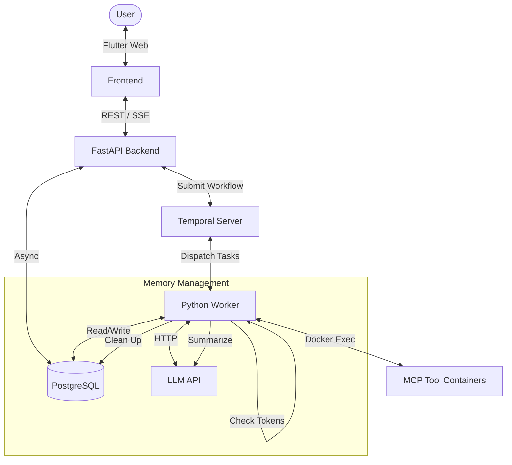

# ThreadBot

ThreadBot is a premium, thread-based AI chatbot powered by **Temporal** for robust workflow orchestration and **Model Context Protocol (MCP)** for extensible tool support.

It features a modern, responsive Flutter web interface, an asynchronous FastAPI backend, and a context-aware memory system that automatically compacts conversation history to stay within LLM token limits.

## Key Features

- **Thread-Based Conversations**: Organize your chats into threads with automatic title generation.
- **MCP Tool Support**: Integrate with any MCP-compatible tool server via Docker sidecars.
- **Advanced Memory**: 
    - **Tool Persistence**: Every tool call and result is saved to the database and replayed to the LLM.
    - **Conversational Compaction**: Automated, token-aware summarization of older history to manage context window limits.
- **Real-time Streaming**: Instant token display via SSE (Server-Sent Events) and Temporal-backed streaming.
- **Premium UI**: Dark-themed, Material 3 design with smooth animations and rich markdown support.

## Deployment

ThreadBot is fully containerized and supports local deployment via Docker Compose as well as production-ready Kubernetes deployments.

## Architecture

ThreadBot leverages Temporal to ensure that long-running tool executions and LLM calls are reliable, even in the event of network failures or restarts.

### Core Components
- **Frontend (Flutter)**: A state-of-the-art SPA that handles message streaming, markdown rendering, and MCP server management.
- **Backend (FastAPI)**: Acts as a thin gateway between the frontend and the Temporal engine.
- **Temporal Worker**: The "brain" of the system. It executes the `RunThreadWorkflow` which handles discovery, tool execution, and context management.
- **MCP Sidecars**: Ephemeral Docker containers that provide specialized tools (e.g., filesystem access, database queries, API integrations) to the LLM.

## Configuration

ThreadBot can be configured via the Settings screen in the UI:
1. **LLM Config**: Set your API URL, Model Name, and API Key (supports Ollama by default at `host.docker.internal:11434`).
2. **Context Management**: Configure the Context Window size, Compaction Threshold, and how many recent messages to keep uncompacted.
3. **MCP Servers**: Add and manage tool servers by specifying their Docker image and environment variables.

## Development

For detailed developer instructions, architectural deep-dives, and coding rules, see:
- **[DESIGN.md](./DESIGN.md)**: Full architectural specification and sequence diagrams.
- **[AGENTS.md](./AGENTS.md)**: Comprehensive guide for AI coding assistants.

## License

This project is licensed under the Apache License 2.0.
