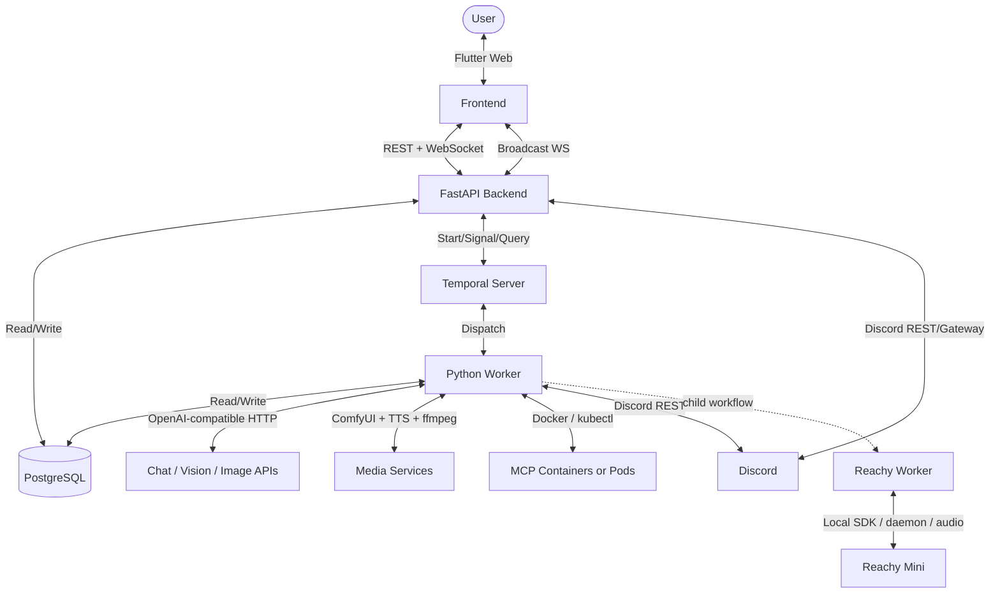

# ThreadBot

ThreadBot is a thread-based AI chatbot backed by **Temporal** durable workflows, a **FastAPI** backend, a **Flutter Web** frontend, and extensible tool execution through **MCP**, built-in tools, Discord, image/video generation, and optional **Reachy Mini** robot integration.

Read the original project write-up here: <https://miketoscano.com/blog/threadbot-temporal.html>. The codebase has evolved since that post; this README describes the current implementation.

## Highlights

- **Thread-based chat**: Conversations are stored as threads with self-referencing replies for branching, automatic title generation, live sidebar updates, and per-thread metadata.
- **Durable agent runs**: Each user turn runs as a Temporal `RunThreadWorkflow`, so long tool chains, media generation, Discord interactions, and robot speech can survive process restarts and deploys.
- **WebSocket streaming**: The frontend sends chat requests to `/api/chat/ws` and receives structured events from Temporal workflow streams. Refresh/reconnect uses `/api/threads/{id}/ws` and Temporal stream offsets.
- **OpenAI Agents SDK loop**: The workflow uses the OpenAI Agents SDK with a Temporal plugin for model calls. Tool callbacks dispatch Temporal activities for retries, timeouts, DB persistence, and UI event streaming.
- **MCP tools**: Add MCP servers at runtime, discover/cached tools, pass encrypted env vars/args/registry credentials, and run tools via Docker locally or Kubernetes pods in production.
- **Built-in tools**: Built-ins include web fetch, image description, image recipe extraction, image/video generation, context compaction helpers, current datetime, calculator, JSON parsing, text counting, and base64 encode/decode.
- **Media support**: Users can upload images, ask vision questions, generate images through OpenAI-compatible providers or ComfyUI, iterate image generation with critique, and generate video with optional TTS, ambient audio, lip sync, and ffmpeg muxing.
- **Context management**: Token-estimated compaction summarizes older messages into system context. The agent can also call context overview/compaction tools to compact selected topics.
- **Per-thread controls**: Threads can override selected LLM settings such as model, provider, system prompt, context limits, vision settings, TTS settings, and media settings. Threads also have per-server/per-tool MCP overrides.
- **Discord integration**: ThreadBot can create/sync Discord threads, answer slash commands and bot mentions, poll linked Discord threads, index Discord history, sync tool activity, copy image attachments into ThreadBot storage, and apply Discord-server MCP overrides.
- **Reachy Mini integration**: A local Reachy profile can bind one ThreadBot thread to a robot, listen for a wake word, submit voice prompts, run local hardware tools, speak responses through a child speech workflow, and capture/describe camera images.

## Quick Start

Requirements:

- Docker with Compose v2
- An OpenAI-compatible chat endpoint, such as Ollama on the host at `http://host.docker.internal:11434/v1`

Start the core web application:

```bash
docker compose up --build
```

Open:

- Frontend: <http://localhost:3000>
- Backend health: <http://localhost:8000/health>
- Temporal UI: <http://localhost:8080>

The default Compose stack starts the core services: PostgreSQL, Temporal, Temporal UI, backend, worker, and frontend. The optional Reachy services are behind the `reachy` Compose profile.

## Configuration

Most settings can be configured from the UI and are persisted in PostgreSQL. Environment variables and Compose/Kubernetes config values are defaults; DB settings take precedence after startup.

Important setting groups:

- **Chat LLM**: provider, API URL, API key, model, temperature, max tokens, stream timeout, max agent iterations.
- **Context**: context window, compaction threshold, preserved recent messages, tool result truncation.
- **Vision and images**: vision provider/model/API, image generation provider/model/API, ComfyUI workflow presets and generation defaults.
- **Video and audio**: ComfyUI video/lip-sync workflows, output dimensions, frame limits, TTS provider/model/voice, audio mux settings.
- **MCP servers**: Docker image, env vars, args, registry credentials, active state, cached tool definitions.
- **Discord**: enable flag, bot token, guild ID, default channel ID, poll interval.
- **Reachy**: enable flag, bound thread ID, wake word, daemon URL, local task queue, media backend, output volume, speech mood.

Per-thread LLM overrides are available from the chat UI and are stored on the `threads.llm_overrides` JSONB column.

## Core Architecture



### Main Components

| Component | Role |
| --- | --- |
| `frontend/` | Flutter Web SPA with chat, sidebar, streaming UI, image upload, MCP management, settings, Discord share controls, Reachy binding, per-thread tool overrides, and per-thread LLM overrides. |
| `backend/app/main.py` | FastAPI app startup, schema bootstrap, DB-backed settings load, Temporal client/plugin setup, and background Discord poll/gateway tasks. |
| `backend/app/api/routes.py` | REST/WebSocket API for chat, reconnect, threads, settings, generated images/media, uploads, MCP, Discord, Reachy binding, and overrides. |
| `backend/app/worker.py` | Main Temporal worker for chat and Discord indexing workflows plus LLM/MCP/media/Discord activities. |
| `backend/app/workflows/thread_workflow.py` | Main chat workflow: history, compaction, tool discovery, Agents SDK run, tool activity dispatch, streaming events, save final response, media URL recovery, and title generation request. |
| `backend/app/activities/llm_activities.py` | DB activities, MCP discovery/execution, built-in tools, image/video/TTS helpers, Discord sync, title generation, compaction, and Discord history indexing. |
| `backend/app/discord_integration.py` and `discord_bot.py` | Discord REST helpers, polling loop, slash command and mention gateway bot, thread creation/linking, history indexing, deduplication, and attachment persistence. |
| `backend/app/reachy_worker.py` | Local Temporal worker for Reachy hardware/speech task queue. Runs on the machine with robot/audio/camera access. |
| `backend/app/reachy_bridge.py` | Local voice bridge that listens for wake word or typed input, starts ThreadBot turns, supports interruption, and streams response text to Reachy speech. |
| PostgreSQL | Stores threads, messages, generated media, MCP servers, settings, Discord links/servers/overrides, and tool/LLM overrides. |
| Temporal | Durable orchestration for chat, Discord indexing, model calls, tool calls, media generation, and Reachy speech. |

## Chat Flow

1. The Flutter frontend opens `/api/chat/ws` and sends a `ChatRequest` JSON payload.
2. The backend loads DB-backed settings, creates or resolves the thread, saves the user message, applies per-thread tool and LLM overrides, attaches Discord config if the thread is linked, and starts `RunThreadWorkflow`.
3. The backend sends a `thread` event containing `thread_id` and `workflow_id`, then relays Temporal workflow stream events over the WebSocket.
4. The workflow fetches history with `get_messages`, compacts context if needed, discovers MCP tools, appends built-in tools, and runs the OpenAI Agents SDK.
5. Each tool callback starts a Temporal activity. Tool calls/results are saved to the DB and emitted as structured stream events.
6. Model token deltas are emitted through the Temporal OpenAI Agents plugin topic and relayed to the frontend as `token` events.
7. The workflow saves the final assistant message, asks for title generation when appropriate, emits terminal state, and returns.
8. The backend starts title generation as a standalone activity, sends `done`, and the frontend silently reloads the thread from the DB.

In-progress thread detection no longer depends on Redis. The backend checks Temporal for running workflow IDs with `thread-*`, `discord-thread-*`, or `reachy-thread-*` prefixes.

## Stream Events

The UI receives JSON events over WebSockets. Common event types are:

| Type | Meaning |
| --- | --- |
| `thread` | Initial event with `thread_id` and `workflow_id`. |
| `token` | Model output delta. |
| `thinking` | Intermediate reasoning/thinking content saved for display. |
| `tool_call` | One or more tools started. |
| `tool_result` | Tool finished, including success/failure and optional image URL. |
| `context` | Estimated context usage update. |
| `compaction` | Context compaction happened. |
| `continue_prompt` | UI should ask whether the agent should continue. |
| `title` | Thread title update from title activity/broadcast. |
| `done` | Workflow completed. |
| `error` | Workflow or streaming error. |

The frontend also subscribes to `/api/broadcast/ws` for thread-list updates from title changes, Discord indexing, and other background changes.

## MCP Tools

MCP servers are managed from the MCP screen. Each server stores:

- name and Docker image
- encrypted environment variables
- encrypted CLI args
- encrypted registry credentials
- active/inactive flag
- cached tool definitions and cache timestamp

Discovery reads active servers, starts a temporary MCP connection, caches tools, and applies overrides. Local execution uses Docker; Kubernetes execution uses `kubectl run` pods with RBAC from the deployment manifests. Tool names are exposed to the LLM in OpenAI function format and mapped back to their MCP server at execution time.

## Discord

Discord is optional and enabled with `DISCORD_ENABLED=true` plus a bot token. The backend starts two background tasks on startup:

- `discord_poll_loop`: polls linked Discord threads for new user messages and starts ThreadBot workflows.
- `run_discord_bot`: connects a `discord.py` gateway bot for `/threadbot` slash commands and bot mentions.

Capabilities:

- Share an existing ThreadBot thread to Discord from the chat UI.
- Start a new ThreadBot thread from `/threadbot prompt` or by mentioning the bot.
- Reply inside an existing Discord thread and continue the linked ThreadBot thread.
- Index Discord thread history through `IndexDiscordThreadWorkflow`.
- Store links in `discord_thread_links` and server metadata in `discord_servers`.
- Apply MCP enable/disable overrides per Discord guild through `discord_server_tool_overrides`.
- Copy Discord image attachments into ThreadBot-generated image storage before CDN URLs expire.
- Sync assistant responses and selected tool activity back into Discord.

## Reachy Mini

Reachy support is optional and intended to run locally on the machine attached to the robot. Start the profile with:

```bash
docker compose --profile reachy up --build reachy-daemon reachy-worker reachy-bridge
```

or use:

```bash
./run-reachy.sh start
```

Reachy pieces:

- `reachy-daemon`: local daemon/container with privileged hardware, audio, camera, and GStreamer access.
- `reachy-worker`: Temporal worker on `REACHY_TASK_QUEUE` for robot hardware and speech activities.
- `reachy-bridge`: voice/typed bridge that listens for the wake word, starts ThreadBot workflows, handles interruption, and routes response text to speech.
- `ReachySpeechWorkflow`: child workflow that plays thinking animations while the parent chat workflow is working, speaks flushed/final text, handles announcements, and supports immediate interrupt.
- Reachy tools exposed only to the bound thread: `reachy_move`, `reachy_animation`, and `reachy_capture_image`.

See `docs/reachy-compose.md` and `scripts/reachy/README.md` for local setup and audio/camera tuning.

## Development

Run all core services:

```bash
docker compose up --build
```

Backend local development:

```bash
cd backend
pip install -r requirements.txt
uvicorn app.main:app --reload
```

Frontend local development:

```bash
cd frontend
flutter pub get
flutter build web --release
flutter analyze
flutter test
```

Reachy local dependencies:

```bash
cd backend
pip install -r requirements-reachy.txt
```

## Kubernetes

Production manifests are in `k8s/`, and `deploy.sh` interactively builds/pushes images and generates config. The Kubernetes deployment assumes PostgreSQL, Temporal, and any external model/media services are reachable from the cluster.

The deployment includes:

- backend replicas
- main worker
- frontend served by nginx
- nginx proxy/LoadBalancer
- MCP pod RBAC
- MCP cleanup CronJob

Reachy is not a normal cluster workload; run Reachy services on the local robot host and point them at the same Temporal/PostgreSQL deployment.

## Documentation

- `DESIGN.md`: detailed architecture, data model, workflows, routes, and integration notes.
- `docs/reachy-compose.md`: Reachy Compose profile and local voice/media tuning.
- `scripts/reachy/README.md`: platform-specific Reachy install scripts.
- `AGENTS.md`: project-specific guidance for coding assistants.

## License

Apache License 2.0. See `LICENSE`.
