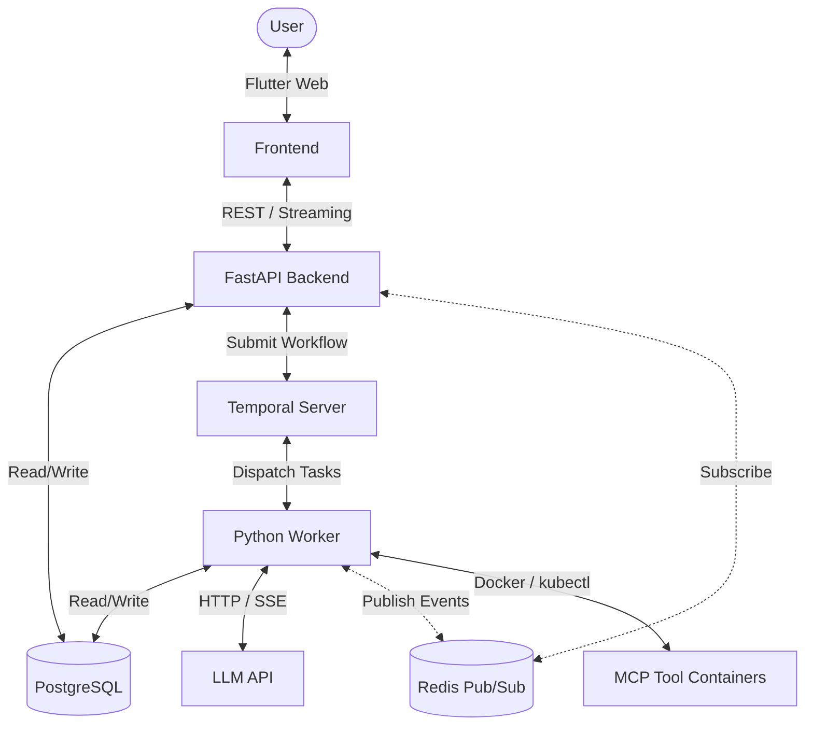

# ThreadBot

Read the blog post about ThreadBot on my website [here](https://miketoscano.com/blog/threadbot-temporal.html)

ThreadBot is a thread-based AI chatbot powered by **Temporal** for robust workflow orchestration and **Model Context Protocol (MCP)** for extensible tool support.

It features a responsive Flutter web interface, an asynchronous FastAPI backend, real-time token streaming via Redis pub/sub, and a context-aware memory system that automatically compacts conversation history to stay within LLM token limits.

## Key Features

- **Thread-Based Conversations**: Organize chats into threads with automatic title generation that updates the sidebar in real time.
- **MCP Tool Support**: Integrate with any MCP-compatible tool server via Docker sidecars or Kubernetes pods. Tool calls and results are rendered as interactive chips with per-tool status indicators. Discovered tools are cached in the database for instant retrieval.
- **Per-Thread Tool Overrides**: Enable or disable individual MCP tools or entire servers on a per-thread basis via an in-chat tool configuration panel. Tool-level overrides take precedence over server-level.
- **Token-by-Token Streaming**: LLM responses stream to the UI token by token via Redis pub/sub, with progressive markdown rendering. Stream reconnect after page refresh replays buffered events seamlessly.
- **Advanced Memory**: 
    - **Tool Persistence**: Every tool call and result is saved to the database and replayed to the LLM across turns, maintaining full "tool memory."
    - **Conversational Compaction**: Automated, token-aware summarization of older history to manage context window limits.
    - **Tool Result Truncation**: Configurable truncation of large tool results for the LLM context (full results preserved in DB and UI) with LLM-aware notices.
- **Agent Loop**: Multi-step tool execution with thinking blocks, capped at configurable max iterations (default 25). The LLM can chain multiple tool calls before producing a final response.
- **Built-in Tools**: 8 tools that execute in-process without MCP containers: `continue_thinking` (extends reasoning), `web_fetch`, `current_datetime`, `calculator`, `json_parse`, `text_count`, `base64_encode`, `base64_decode`. Always available regardless of MCP configuration.
- **Premium UI**: Dark-themed, Material 3 design with skeleton shimmer loaders, collapsible thinking blocks, per-chip tool pulse animations with loading spinners, expandable tool input/output blocks, response timeline visualization, context consumption donut chart, and rich markdown support.
- **Response Timeline**: Each assistant message includes a compact horizontal timeline showing the sequence of thinking, tool calls, tool results, compaction, and response steps with animated progress indicators.
- **Context Awareness**: Real-time context window consumption donut chart in the chat input area (color-coded green/amber/red). Updated after every LLM call and compaction event.

## Quick Start (Docker Compose)

```bash
# Start all 7 services: postgres, temporal, temporal-ui, redis, backend, worker, frontend
docker compose up --build

# Access the app
open http://localhost:3000        # Frontend
open http://localhost:8080        # Temporal UI
curl http://localhost:8000/health # Backend health check
```

Requires Docker with Compose v2. Ollama must be installed and running on the host for LLM inference (`http://host.docker.internal:11434`).

## Kubernetes Deployment

ThreadBot assumes Postgres, Temporal, and Redis are external services in production. The interactive deploy script handles configuration and multi-arch image builds:

```bash
./deploy.sh
```

The script prompts for:
- Container registry prefix and image pull secret
- PostgreSQL connection details
- Temporal host, port, namespace, and task queue
- Redis host, port, and DB number
- LLM API URL, key, and model

It generates `k8s/configmap.yaml`, builds multi-arch images (amd64 + arm64), pushes to your registry, and applies all Kubernetes manifests. The K8s deployment includes:
- Backend (2 replicas) and Worker (1 replica) deployments
- Frontend (2 replicas) served via nginx
- A dedicated nginx proxy with a LoadBalancer service for routing
- RBAC for MCP pod management (ServiceAccount, Role, RoleBinding)
- A CronJob for cleaning up completed/failed MCP pods every 15 minutes

## Architecture



### Core Components

| Component | Role |
|-----------|------|
| **Frontend** (Flutter) | SPA with token streaming, markdown rendering, tool call UI, response timeline, context donut chart, per-thread tool overrides, smart auto-scroll, and MCP server management |
| **Backend** (FastAPI) | Gateway between frontend and Temporal. Subscribes to Redis and relays streaming events to the frontend via `StreamingResponse`. Manages MCP server CRUD with encryption at rest |
| **Worker** (Temporal) | Executes `RunThreadWorkflow`: agent loop with MCP + built-in tool execution, per-thread tool filtering, tool result truncation, token streaming, context usage publishing, auto-title generation |
| **Redis** | Pub/sub broker bridging worker -> backend for real-time streaming. Also buffers events in Redis lists for stream reconnect after page refresh. Tracks generation status |
| **PostgreSQL** | Stores threads, messages (user/assistant/thinking/tool_call/tool_result/system), MCP server configs (encrypted), tool overrides, cached tool lists, and persistent settings |
| **Temporal** | Orchestrates workflows with retry policies and fault tolerance |
| **MCP Sidecars** | Ephemeral containers providing tools (filesystem, APIs, databases) to the LLM. Uses Docker locally and `kubectl run` pods in Kubernetes |

### Streaming Flow

1. User sends a message -> backend saves it to DB, subscribes to a Redis channel, sets generating flag in Redis, starts the Temporal workflow
2. Worker runs the agent loop: non-streaming LLM calls during tool iterations (MCP and built-in tools), publishing `thinking`, `tool_call`, `tool_result`, `compaction`, and `context` events to Redis (both pub/sub and an event buffer list)
3. Final LLM call uses `stream: true` -- each SSE token is published to Redis as `{"type":"token","content":"..."}`
4. Backend relays all Redis events to the frontend via chunked HTTP response
5. Frontend appends tokens to a placeholder message, rendering markdown progressively
6. After saving, the worker publishes `title` and `[DONE]` events. The sidebar updates instantly with the generated title

### Stream Reconnect

If the user refreshes the page mid-response, the frontend detects the thread is still generating (`is_generating` field in the thread response) and reconnects:

1. Frontend loads persisted messages from the DB
2. Connects to `GET /api/threads/{id}/stream` which polls the Redis event buffer list
3. All buffered events replay from the beginning, rebuilding thinking/tool_call/tool_result bubbles and streaming tokens
4. New events continue to arrive via polling until `[DONE]`
5. Standard silent DB reload finalizes the view

## Configuration

Settings are persisted in the PostgreSQL database and survive pod/container restarts. Configure via the Settings screen in the UI:

1. **LLM Config**: API URL, model name, API key, temperature, max tokens (supports Ollama by default)
2. **Context Management**: Context window size, compaction threshold percentage, number of recent messages to preserve
3. **Tool Calls**: Maximum characters for tool result truncation (0 = no truncation)
4. **MCP Servers**: Add and manage tool servers by specifying their Docker image, environment variables, and container arguments. Test connections to discover and cache available tools.
5. **Per-Thread Tool Overrides**: Use the wrench icon in the chat input to enable/disable specific tools or entire MCP servers for individual threads.

Environment variables (via configmap or `.env`) serve as defaults. Once settings are saved through the UI, DB values take precedence and persist across restarts.


# Development
Test the whole stack easily with docker
```
docker compose up --build -d
```

For detailed developer instructions, architectural deep-dives, and coding rules, see:
- **[DESIGN.md](./DESIGN.md)**: Full architectural specification, data flow diagrams, and streaming details.
- **[AGENTS.md](./AGENTS.md)**: Comprehensive guide for AI coding assistants with gotchas and project structure.

## License

This project is licensed under the Apache License 2.0.
