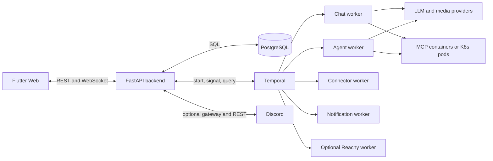

# ThreadBot

ThreadBot is a thread-centric AI workspace built with **FastAPI**, **Flutter Web**, **PostgreSQL**, and **Temporal**. A Thread can be a conventional streamed chat or a durable multi-agent workspace. Agents share the Thread transcript while retaining immutable instructions, selected tools and Skills, policy context, run history, approvals, artifacts, and independent adaptive heartbeat schedules.

Project background: <https://miketoscano.com/blog/threadbot-temporal.html>. The article describes the project's origins; this README describes the current repository.

## What ThreadBot Does

- Runs normal conversational Threads with token streaming, history compaction, MCP tools, Skills, media generation, Discord, and optional Reachy integration.
- Converts an existing or new Thread between **Chat** and **Agent** mode without discarding its transcript or Agent configuration.
- Hosts multiple thread-local Agents with stable `@handles`, one moderator, attributed messages, and deterministic mention routing.
- Executes Agent turns as durable, version-pinned Temporal workflows with run events, actions, approvals, budgets, audit records, and replay metadata.
- Runs opt-in adaptive Agent heartbeats that choose a bounded next wake time and enter the same serialized Thread execution queue as user-triggered work.
- Provides connectors, credentials, notifications, typed handoffs, artifacts, retention controls, replay, canary/shadow evaluation, forecasts, SLO metrics, queue controls, and recovery records.
- Defaults to unauthenticated local operation, with an optional runtime-switchable admin-token mode.

## Feature Status

| Area | Status | Notes |
| --- | --- | --- |
| Threaded chat and WebSocket streaming | **Implemented** | PostgreSQL persistence and Temporal Workflow Streams; no Redis dependency for chat transport. |
| Chat/Agent Thread modes | **Implemented** | Existing Threads can switch modes while preserving transcript and Agent configuration. |
| Multi-agent Threads | **Implemented** | Thread-local Agents, moderator fallback, `@handle` routing, attributed output, and bounded sequential Agent-to-Agent turns. |
| Adaptive background heartbeats | **Implemented** | Per-Agent durable Temporal supervisor with min/max cadence, no-op backoff, wake-now, and persisted status. |
| Agent versions, runs, events, and dry runs | **Implemented** | Immutable activated versions and source-linked, version-pinned run records. |
| Schedules, connectors, webhooks, and manual triggers | **Implemented, gated** | Controlled by autonomy feature flags; inbound autonomy webhooks remain disabled in local security mode. |
| Policies, approvals, budgets, and audit | **Implemented, evolving** | Durable control-plane records and execution gates exist; see [Security and effect safety](#security-and-effect-safety). |
| Replay, canary/shadow, forecasts, and SLOs | **Implemented** | Recorded/effect-free replays, canary promotion/rollback, P50/P90 forecasts, alerts, and queue controls. |
| MCP and built-in tools | **Implemented** | Chat uses per-Thread overrides; Agents use immutable version selections and server-side execution checks. |
| Skills | **Implemented** | Global management, Thread controls, and immutable Agent runtime snapshots. |
| OSRS DPS loadouts | **Implemented, optional** | Named workspace loadouts, Wiki DPS imports, full web editing, per-Thread selection, Discord `/loadout` commands, and exact MCP-backed calculations. |
| Context dashboard and compaction | **Implemented** | Token estimates, context composition, summaries, and token-aware compaction. |
| Image upload, vision, and media generation | **Implemented, provider-dependent** | OpenAI-compatible APIs, ComfyUI, TTS, ffmpeg, and model assets may be required. |
| Discord | **Implemented, optional** | Linked Threads, textual Agent handles under one bot identity, media synchronization, and safe mention handling. |
| Reachy Mini Lite | **Implemented, environment-specific** | Voice, speech, camera, motion workflows, and Thread binding require robot-host dependencies. |
| Conversation branching | **Partial** | Parent/reply persistence and APIs exist; the primary UI remains a linear Thread experience. |
| OIDC | **Reserved, not configured** | `SECURITY_MODE=oidc` currently returns a not-configured response. |

## Core Product Model

### The Thread is the top-level workspace

The main UI is a Thread list and transcript. There is no separate top-level chat-versus-autonomy application shell.

- A **Chat Thread** sends composer input through `RunThreadWorkflow` and streams tokens and tool activity to the browser.
- An **Agent Thread** stores the user's message once, routes it to an Agent, creates an `AgentRun`, and displays durable run status and attributed output in the same transcript.
- Switching an Agent Thread back to Chat mode does not delete its Agents, versions, runs, approvals, or artifacts. Switching back reuses that configuration.
- Agent Threads are archived rather than hard-deleted when durable Agent evidence exists.

Thread settings are consolidated in the composer control surface:

- General and Chat/Agent mode
- Agents and heartbeat controls
- Context
- Response/LLM overrides
- MCP tool overrides
- Active OSRS DPS loadout
- Links to global Settings, MCP servers, Skills, and the all-Agents view

### Multi-agent routing

Agents belong to exactly one Thread and are not reusable global participants.

- Each Agent has a case-insensitive, mention-safe handle such as `@researcher`.
- One active Agent is the Thread moderator.
- `@handle` in ThreadBot or a linked Discord Thread routes to that active Agent.
- If no valid Agent handle is present, an Agent Thread routes to its active moderator.
- More than one distinct Agent mention is rejected as ambiguous rather than fanning out concurrently.
- An Agent may mention one other active Agent to enqueue one bounded sequential follow-up turn.
- `@user` is reserved for addressing the originating human. In Discord it is converted only to that exact user's native mention when their ID is known.

All visible Agent messages carry durable Agent, version, run, name, and handle attribution. The current Agent's immutable instructions are isolated from historical user text and other-Agent output; collaboration context is labeled as evidence rather than injected as authoritative system instructions.

### Adaptive heartbeats

An enabled Agent can own one long-lived `AgentHeartbeatWorkflow` with stable ID `agent-heartbeat:{agent_id}`.

1. The workflow loads desired heartbeat state from PostgreSQL.
2. It waits until `next_wake_at`, or until a configuration/wake-now signal arrives.
3. It materializes a version-pinned heartbeat `AgentRun` without creating a synthetic user message.
4. The run enters the Thread's FIFO coordinator, so it cannot race a user turn or another Agent writing the same transcript.
5. Completion updates last decision, last run, error state, no-op count, and next wake.

The server clamps Agent-requested cadence to configured minimum/maximum values. Consecutive no-ops back off exponentially up to the configured maximum. Heartbeat evaluation receives the Agent's immutable mandate, wall-clock context, prior outcome timestamps, and selected-tool evidence, but not the shared transcript as executable instruction.

Heartbeat output is fail-closed: a background run cannot publish a non-empty status claim unless it obtained successful tool evidence during that run, unless the immutable Agent version explicitly opts into `allow_heartbeat_response_without_tools`. This prevents unsupported external-status reports from being repeatedly written to the Thread.

## Architecture


```mermaid
flowchart LR
  UI[Flutter Web] <-->|REST and WebSocket| API[FastAPI backend]
  API <-->|SQL| DB[(PostgreSQL)]
  API <-->|start, signal, query| TEMP[Temporal]

  TEMP --> CHAT[Chat worker]
  TEMP --> AGENT[Agent worker]
  TEMP --> CONN[Connector worker]
  TEMP --> NOTIFY[Notification worker]
  TEMP --> REACHY[Optional Reachy worker]

  CHAT --> LLM[LLM and media providers]
  AGENT --> LLM
  CHAT --> MCP[MCP containers or K8s pods]
  AGENT --> MCP
  API <-->|optional gateway and REST| DISCORD[Discord]
```

### Chat execution

1. Flutter connects to `WS /api/chat/ws` with a message, optional image URLs, and a Thread ID.
2. FastAPI authenticates or assigns the local actor, resolves the owned Thread, and acquires the Thread execution lease.
3. Chat Threads start `RunThreadWorkflow` on `chatbot-task-queue`.
4. The workflow loads history, applies Thread settings and Skills, compacts context when needed, discovers enabled MCP tools, and performs the bounded model/tool loop.
5. Structured events stream over the WebSocket and are persisted where applicable.
6. The final assistant message and title are stored before the terminal event; the frontend then reconciles against PostgreSQL.

Current event types include `thread`, `token`, `thinking`, `tool_call`, `tool_result`, `context`, `continue_prompt`, `title`, `done`, and `error`. Reconnect is available at `WS /api/threads/{thread_id}/ws` using Temporal stream offsets where available. Broadcast WebSockets notify other connected clients, but PostgreSQL and Temporal remain the durable sources of truth.

### Agent execution

1. The API parses Agent mentions deterministically or selects the moderator.
2. It stores one input `Message`, one deduplicated `TriggerEvent`, and one version-pinned `AgentRun`.
3. `TriggerDispatchWorkflow` submits the run to stable `thread-coordinator:{thread_id}`.
4. `ThreadTurnCoordinatorWorkflow` serializes all Agent runs for that Thread, including approval waits and heartbeat runs.
5. `AgentRunWorkflow` captures an immutable runtime snapshot and starts `PolicyAwareThreadTurnWorkflow`.
6. The policy-aware workflow builds identity-isolated context, plans responses/actions, persists action requests, applies effect gates, waits for approvals when required, rechecks authorization, and executes allowed tools.
7. Terminal projection writes attributed output, run events, state diffs, notification work, and any bounded next-Agent turn.

`AgentCoordinatorWorkflow` remains registered for compatibility with older Temporal histories, but new multi-agent dispatch is serialized by the per-Thread coordinator.

### Durable data model

PostgreSQL is the operational source of truth. Important record groups include:

- Threads, Messages, Thread tool/Skill/LLM overrides, Discord links, and Reachy bindings
- Agents, drafts, immutable versions, templates, triggers, and adaptive heartbeats
- Trigger events, runs, steps, actions, ordered run events, state snapshots, and Thread execution leases
- Policies, risk profiles, budget profiles/reservations, approvals, authorization hashes, and audit events
- Credentials, encrypted versions, bindings, connectors, cursors, notification routes/deliveries, and dead letters
- Handoffs, contracts, SLA incidents, artifacts, legal holds, retention/tombstone records, and recommendations
- Replay sessions, canary assignments/comparisons, forecasts, SLO metrics/alerts, queue controls, outbox, and idempotency records

Messages are the readable Thread projection; they do not replace normalized run, action, approval, artifact, or audit records.

## Quick Start

### Prerequisites

- Docker Engine and Docker Compose v2
- Git
- An OpenAI-compatible model endpoint reachable by the workers

The Compose default expects Ollama-compatible chat at `http://host.docker.internal:11434/v1`. Override `LLM_API_URL`, `LLM_MODEL`, and related values in an ignored `.env` file or through Settings.

### Chat stack

```bash
docker compose up --build
```

This starts PostgreSQL, Temporal, Temporal UI, the Alembic migration job, FastAPI backend, chat worker, and Flutter/nginx frontend.

- App: <http://localhost:3000>
- Health: <http://localhost:8000/health>
- Temporal UI: <http://localhost:8080>

### Agent and background-worker stack

Autonomy workers are opt-in under the Compose `autonomy` profile. Start with effects disabled:

```bash
cat > .env <<'EOF'
SECURITY_MODE=local
AUTONOMY_ENABLED=true
AUTONOMY_SIDE_EFFECTS_ENABLED=false
AUTONOMY_WEBHOOKS_ENABLED=false
AGENTS_ENABLED=true
AGENTS_MANUAL_RUN_ENABLED=true
AGENTS_SCHEDULES_ENABLED=true
AGENTS_CONNECTORS_ENABLED=true
AGENTS_ACTIONS_ENABLED=true
AGENTS_APPROVALS_ENABLED=true
AGENTS_HANDOFFS_ENABLED=true
AGENTS_REPLAY_ENABLED=true
AGENTS_CANARY_ENABLED=true
AGENTS_REACHY_ACTIONS_ENABLED=false
EOF

docker compose --profile autonomy up --build
```

`.env` is ignored by Git. Do not commit provider keys, bot tokens, bootstrap secrets, or generated API tokens.

The autonomy profile adds:

- `agent-worker` on `threadbot-agent`
- `connector-worker` on `threadbot-connectors`
- `notification-worker` on `threadbot-notifications`

Enable `AUTONOMY_SIDE_EFFECTS_ENABLED=true` only after reviewing Agent tool selections and the safety notes below.

### Reachy profile

```bash
docker compose --profile reachy up --build reachy-daemon reachy-worker reachy-bridge
```

Reachy is not required for chat or software Agents. The profile is privileged, uses host networking and host audio/device mounts, and is intentionally environment-specific.

## Configuration

Configuration precedence is:

1. Defaults in `backend/app/config.py`.
2. Environment variables and Compose/Kubernetes configuration.
3. Values persisted through the Settings/security APIs and loaded from PostgreSQL.
4. Per-Thread overrides for explicitly supported LLM, tool, and Skill settings.
5. Immutable AgentVersion configuration for an individual Agent run.

Common infrastructure variables:

| Variable | Purpose |
| --- | --- |
| `DATABASE_URL` | Async PostgreSQL URL. |
| `TEMPORAL_HOST`, `TEMPORAL_PORT`, `TEMPORAL_NAMESPACE` | Temporal connection. |
| `TEMPORAL_TASK_QUEUE` | Interactive chat task queue. |
| `AGENT_TASK_QUEUE` | Agent/coordinator/heartbeat queue. |
| `CONNECTOR_TASK_QUEUE` | Connector queue. |
| `NOTIFICATION_TASK_QUEUE` | Notification queue. |
| `TEMPORAL_PAYLOAD_CODEC_*` | Optional Temporal payload encryption. |
| `TEMPORAL_SEARCH_ATTRIBUTES_ENABLED` | Enables custom autonomy search attributes after cluster registration. |

Common model/integration variables:

- `LLM_API_URL`, `LLM_API_KEY`, `LLM_MODEL`, `LLM_PROVIDER`
- `LLM_CONTEXT_WINDOW`, `LLM_COMPACTION_THRESHOLD`, `LLM_PRESERVE_RECENT`
- `LLM_VISION_*`, `LLM_COMFYUI_*`, `LLM_VIDEO_*`, `LLM_TTS_*`, `LLM_LIPSYNC_*`
- `DISCORD_ENABLED`, `DISCORD_BOT_TOKEN`, `DISCORD_GUILD_ID`, `DISCORD_CHANNEL_ID`
- `REACHY_ENABLED`, `REACHY_DAEMON_URL`, `REACHY_TASK_QUEUE`, and other `REACHY_*` values

See `backend/app/config.py` for the complete set. The Settings screen covers model, context, media, Discord, tools, and runtime security settings; MCP servers and Skills have dedicated screens.

## Security and Effect Safety

### Security modes

`SECURITY_MODE` supports:

- `local` (default): no login is required. Requests use a local owner/admin actor in the default workspace.
- `admin_token`: REST and WebSocket access require a valid admin token/session.
- `oidc`: reserved but not configured.

The Security tab can switch between local and admin-token mode at runtime. Enabling token mode revokes prior workspace API tokens, creates a new `tb_...` token, stores only its Argon2 hash, and displays the plaintext once. The browser can retain the entered/generated token locally so the user can reveal it later and restore an eight-hour sliding HttpOnly session. That convenience means browser local storage is part of the security boundary; use a trusted origin and protect against XSS.

In admin-token mode:

- Configure explicit `CORS_ORIGINS`; wildcard CORS is rejected outside local mode.
- Browser sessions use HttpOnly, SameSite cookies and honor forwarded HTTPS headers.
- API clients may use `Authorization: Bearer <token>`.
- `ADMIN_BOOTSTRAP_TOKEN` is only for initial token creation. Clear it after bootstrap.

### Autonomy is not authentication

Local mode may run Agents and heartbeats when `AUTONOMY_ENABLED=true`. HTTP authentication is not treated as execution authorization. External effects additionally require explicit deployment and feature flags, selected tools, persisted action state, policy evaluation, authorization hashes, and any required approval/budget checks.

Important behavior:

- `AUTONOMY_SIDE_EFFECTS_ENABLED` defaults to `false`.
- Inbound autonomy webhooks remain disabled in local mode even if side effects are enabled.
- Dry-run, replay, and canary-shadow modes suppress external mutations, notifications, handoffs, connectors, credentials, and Reachy effects server-side.
- An explicit empty Agent tool selection means no tools; it does not fall back to all built-ins.
- Heartbeat output without fresh successful tool evidence is suppressed by default.
- MCP tools execute configured container code and can reach configured services. Treat server definitions, images, arguments, and credentials as privileged configuration.

The policy/approval/budget framework is substantial but still evolving. Not every integration has identical policy depth, credential scoping, or notification authorization behavior. Treat unattended side effects as experimental, keep effects disabled by default, use narrowly scoped credentials, and isolate deployments at the network/container/Kubernetes layers.

## Context and Instruction Isolation

The Thread Context view reports token estimates, context window, input budget, remaining tokens, compaction threshold, category composition, and the display-oriented conversation summary.

Interactive chat reconstructs OpenAI-compatible tool history and performs token-aware compaction while preserving recent messages. Agent context is additionally identity-aware:

- The active AgentVersion prompt is wrapped as the only authoritative Agent instruction.
- The exact run input is marked as current.
- Historical user messages, compaction summaries, unattributed assistant messages, and other-Agent output are labeled as non-authoritative context.
- Only the current Agent's attributed tool calls/results are reconstructed as its tool protocol history.
- Selected Skill content is captured in the immutable runtime snapshot.
- Heartbeats omit shared transcript rows and use mandate, time, previous outcome timestamps, and fresh tool evidence.

These boundaries reduce cross-Agent instruction contamination while preserving explicit `@agent` collaboration.

## Tools, MCP, Skills, and Media

### Built-in tools

Chat can expose built-ins in these groups:

- Reasoning/context: `continue_thinking`, `context_overview`, `compact_context_topic`
- Web/time: `web_fetch`, `current_datetime`
- Data: `calculator`, `json_parse`, `text_count`, `base64_encode`, `base64_decode`
- Vision/media: `describe_image`, `extract_image_recipe`, `generate_image`, `iterate_image_generation`, `generate_video`
- Skills: `use_skill`
- Reachy-bound Threads: motion/animation/camera tools when configured

Agent runs advertise only server-approved tools selected in the immutable Agent version. Pure utilities may run locally; effectful tools pass through action authorization and deployment gates.

### MCP

The MCP screen manages server images, encrypted environment variables/arguments, active state, registry credentials, and cached tool definitions. Chat Threads use mutable per-Thread server/tool overrides. Agent versions snapshot selected MCP identities and recheck selection before execution.

- Compose runs MCP servers through Docker using the mounted Docker socket.
- Kubernetes runs temporary MCP pods through `kubectl`; `k8s/rbac.yaml` grants the required pod/attach/log permissions.
- `k8s/cronjob-mcp-cleanup.yaml` removes completed/failed MCP pods.

Only configure trusted MCP images and destinations.

### Skills

Skills are reusable named instruction modules. The Skills screen supports create, edit, enable/disable, and delete. The backend supports per-Thread Skill overrides; the primary Thread settings surface links to the global Skills manager rather than exposing every override inline. Agent versions select Skills immutably; runtime snapshots include selected Skill content so an in-flight run does not change when a Skill is edited later.

### Media

Image upload/vision and image, video, audio, and lip-sync generation are provider-dependent. Compatible endpoints, ComfyUI workflow JSON, model files, ffmpeg, TTS, and persistent storage may be required. Generated assets are served by the backend and can be synchronized to Discord where configured.

## Discord

Discord integration is optional. Configure a bot token, guild/default channel, gateway intents, slash-command permissions, Thread permissions, and attachment permissions.

When the OSRS DPS MCP server is configured, `/loadout` commands can create,
import, inspect, equip, clone, delete, and select named loadouts for linked
Discord Threads. The same workspace loadouts are available in the Flutter UI.

ThreadBot can:

- link a ThreadBot Thread to a Discord Thread;
- create/adopt Threads from Discord;
- index history and synchronize text/media;
- route textual `@AgentHandle` to an Agent under one Discord bot identity;
- route a bot mention with no Agent handle to the moderator;
- label outgoing Agent messages with display name and handle;
- preserve an exact originating Discord user for safe `@user` replies;
- apply per-guild MCP overrides.

Native Discord mentions are normalized before model input. Outbound allowed-mentions payloads deny roles, everyone, and reply pings and permit only explicitly resolved user IDs. Unknown or ambiguous readable names stay inert.

## Reachy Mini Lite

Reachy is an optional robot-host integration. The bridge handles wake-word/voice or typed input, binds a Thread, starts durable work, plays thinking/tool activity, speaks the final response, supports interruption, and returns the robot to idle/sleep behavior.

The Compose Reachy profile uses host networking, privileged device access, audio mounts, Reachy SDK components, camera/microphone dependencies, Pulse/ALSA, GStreamer, and local model configuration. Defaults are not portable across robot hosts. See `scripts/reachy/README.md` and `backend/requirements-reachy.txt`.

Autonomous Reachy actions remain separately gated by `AGENTS_REACHY_ACTIONS_ENABLED` and are disabled in the example configuration.

## Autonomy Control Plane

The backend exposes additive APIs for:

- Agent templates, drafts, immutable versions, lifecycle, manual/dry runs, schedules, and heartbeats
- Thread-local participant CRUD, moderator transfer, and turn limits
- Run events, cancellation, audit events, state diffs, and forecasts
- Connectors, encrypted credentials/bindings, approvals, notification profiles/routes, and dead letters
- Typed handoff contracts, SLA tracking, artifacts, legal holds, retention, and policy recommendations
- Recorded replay and effect-free re-execution replay
- Canary/shadow assignments, comparisons, explicit promotion/rollback
- SLO metrics/alerts, recovery records, and durable queue pause/drain/resume controls

Recorded replay reads persisted evidence only and makes no model or external calls. Re-execution creates a new source-linked run and is effect-free. Canary-shadow runs are effect-free and do not change active runs; promotion changes only the version selected by future runs.

## Database Migrations

Alembic is the sole schema owner. Application startup checks that the database is at the expected head and does not call `create_all`.

```bash
cd backend
alembic upgrade head
alembic current
alembic heads
```

The current linear head is:

```text
0022_agent_heartbeats
```

The migration chain covers the baseline schema, security/audit/outbox foundation, Agents and runtime snapshots, approvals, control-plane features, handoffs/artifacts/retention, replay/canary/SLOs, notification leases, Thread modes, multi-agent attribution, and adaptive heartbeats. Autonomy migrations are intentionally forward-only; take a database backup before upgrading.

Compose runs `alembic upgrade head` in the one-shot `migrate` service before backend/workers start. Kubernetes uses `k8s/migration-job.yaml`.

## Development and Verification

### Backend

```bash
cd backend
pip install -r requirements.txt
uvicorn app.main:app --reload

python -m pytest tests/ -q
python -m compileall -q app
alembic heads
```

The backend suite covers security, migrations, autonomy phases, policy gates, multi-agent routing, heartbeat behavior, notification leases, Discord mention safety, and text sanitization.

### Frontend

```bash
cd frontend
flutter pub get
flutter run -d chrome

flutter analyze
flutter test
flutter build web --release
```

Web-only platform views use conditional implementations so Flutter VM widget tests pass. The Three.js mascot is reserved for the large welcome view; small message avatars are static, and browser render loops/resources are disposed when detached.

### Useful Compose checks

```bash
docker compose config -q
docker compose ps
docker compose logs -f backend
docker compose logs -f worker
docker compose logs -f agent-worker
```

## Kubernetes and GitLab CI

The `k8s/` manifests are environment-specific examples, not a portable production installer. They include:

- Namespace, ConfigMap, and migration Job
- Backend and frontend Deployments/Services
- Versioned chat worker through the Temporal Worker Controller CRD
- Dedicated Agent, connector, and notification Deployments
- MCP pod RBAC and cleanup CronJob
- nginx proxy and LoadBalancer service
- RWX generated-image storage example

Before deployment, provide or adapt:

- reachable PostgreSQL and Temporal;
- a Temporal namespace and, for `k8s/deployment.yaml`, the Temporal Worker Controller plus a `TemporalConnection` named `temporal`;
- registry pull secrets referenced by the manifests;
- `codec-encryption-key` when Temporal payload encryption is enabled;
- an RWX storage class/PersistentVolume if generated files are shared across replicas;
- ingress/LoadBalancer, DNS, TLS, CORS, and network policy;
- real model/provider endpoints and secrets outside the ConfigMap.

The checked-in `k8s/configmap.yaml` contains environment-specific addresses and illustrative defaults. Review it before applying. Secrets should be moved to Kubernetes Secrets or an external secret manager.

GitLab CI builds and publishes multi-architecture backend/worker and frontend images, builds and combines the Reachy architecture images, and updates image references in `k8s/deployment.yaml` on `main`. The pipeline is primarily image/deployment automation; run the test commands above before release.

### Temporal search attributes

Before enabling `TEMPORAL_SEARCH_ATTRIBUTES_ENABLED`, register these `Keyword` search attributes in the target Temporal namespace:

- `ThreadBotWorkspaceId`
- `ThreadBotAgentId`
- `ThreadBotRunMode`

Keep the flag disabled until registration is complete and use the same value across relevant workers.

## Repository Guide

- `backend/app/main.py` - FastAPI lifespan, runtime security/CORS middleware, router registration, and Temporal client.
- `backend/app/api/` - Thread/chat, autonomy phases, approvals, operations, replay, and integration APIs.
- `backend/app/models/` - SQLAlchemy operational model.
- `backend/app/contracts/` - Typed public and workflow/activity contracts.
- `backend/app/workflows/` - Chat, Thread coordinator, Agent run, heartbeat, notification, Discord, retention, and Reachy workflows.
- `backend/app/activities/` - Database, LLM, policy, MCP, heartbeat, connector, notification, media, and Reachy activities.
- `backend/app/agents/` - Agent/version/run, heartbeat, scheduling, and autonomy services.
- `backend/alembic/` - Linear schema migration history.
- `frontend/lib/screens/chat_screen.dart` - Thread-centric product surface.
- `frontend/lib/screens/agent_list_screen.dart` and `agent_detail_screen.dart` - Agent fleet/detail views.
- `frontend/lib/widgets/thread_participant_manager.dart` - Thread Agent roster and heartbeat controls.
- `docker-compose.yml` - Local core, autonomy, and Reachy profiles.
- `k8s/` and `deploy.sh` - Environment-specific Kubernetes deployment assets.
- `docs/autonomy-architecture.md` - Original phased autonomy design specification. Its status banner is historical; this README and the source describe the implemented state.
- `DESIGN.md` - Additional chat/context design notes.

## Known Limitations

- `SECURITY_MODE=local` is intentionally unauthenticated. Use admin-token mode and an authenticated/TLS network boundary before exposing ThreadBot beyond a trusted environment.
- OIDC is not configured.
- Unattended external effects are powerful and still evolving. Policy, approval, budget, credential, notification, connector, MCP, and hardware paths do not all have identical enforcement depth.
- Heartbeats cannot truthfully observe external state without a selected working tool. Unsupported output is suppressed by default, but model/provider behavior and tool correctness still require monitoring.
- PostgreSQL, Temporal, model endpoints, MCP runtimes, media providers, Discord, and Reachy are independent failure domains.
- Broadcast WebSockets are process-local notifications, not a durable event bus. Clients reconcile against PostgreSQL/Temporal after reconnect.
- Conversation branching is persisted but not a complete first-class frontend workflow.
- Some older fleet administration screens/routes remain compatibility surfaces while the Thread-centric UI is the primary experience.
- Kubernetes manifests contain cluster-specific names, addresses, storage classes, and registry assumptions and must be reviewed before use.

## License

Apache License 2.0. See [`LICENSE`](LICENSE).
