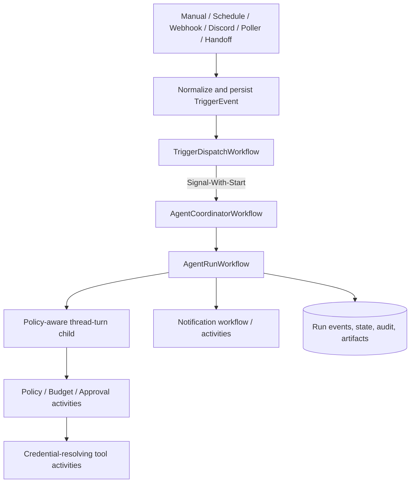

# ThreadBot Autonomous Agents Architecture

> **Status: future design, not implemented.**
>
> This document is an implementation blueprint for adding durable autonomous
> agents to ThreadBot. It is intentionally isolated from `DESIGN.md`, which
> describes the current system. Nothing in this document should be presented as
> a currently available feature until the corresponding phase is complete.

## 1. Purpose

ThreadBot should support agents attached to threads that can pursue bounded
goals, run on schedules, monitor external sources, request approval for risky
actions, and report results through the thread, Discord, Reachy, or future
notification channels.

The generalized execution model is:

```text
Trigger -> deterministic policy -> bounded run -> notification
```

Examples are configurations of this model rather than separate systems:

- Research a subject periodically and report meaningful changes.
- Monitor a service or Temporal workload and recommend remediation.
- Continue working toward a goal in bounded cycles and notify Discord when it
  succeeds, stalls, or needs approval.
- React to a signed webhook or Discord event.
- Perform an approved external mutation or supervised Reachy action.
- Hand a typed task to another agent and enforce an SLA on the response.

This design preserves ThreadBot's current interactive chat path. Autonomous
execution is an additional control plane, not a timer wrapped around
`RunThreadWorkflow`.

## 2. Delivery Model

There is one mandatory prerequisite foundation followed by exactly four
product phases:

| Stage | Outcome |
|---|---|
| Prerequisite foundation | Security, migrations, durable contracts, audit, policy, idempotency, and cross-replica event delivery |
| Phase 1 | Manual and scheduled read-oriented agents, templates, dry run, forecasts, and run timelines |
| Phase 2 | Monitoring connectors, controlled actions, approvals, notifications, state diffs, and dead letters |
| Phase 3 | Typed agent handoffs, SLA escalation, operational scaling, retention, and policy recommendations |
| Phase 4 | Replay, canary/shadow versions, advanced forecasting, observability, and production hardening |

The prerequisite foundation is not a product phase. Side-effecting autonomy
must remain disabled until its security and correctness gates pass.

## 3. Current-System Constraints

The implementation must respect these existing facts:

- Interactive turns run through `backend/app/workflows/thread_workflow.py`.
- Token and tool events use Temporal Workflow Streams relayed over WebSockets.
- PostgreSQL is the durable application store.
- The broadcast WebSocket currently relies on process-local state and is not a
  durable cross-replica channel.
- MCP, Skills, Discord, media, and Reachy already have distinct execution and
  permission characteristics.
- The frontend uses per-screen `StatefulWidget` and `setState`; no global
  provider should be introduced.
- Runtime schema upgrades currently use `create_all()` plus additive startup
  DDL. That is not sufficient for the number of constraints in this design.
- ThreadBot currently has no authentication or authorization and must be
  treated as trusted-network software.
- Credentials are present in current settings and some workflow inputs. Future
  autonomous workflows must use credential references instead.
- Existing branching has parent-link storage/API groundwork but no complete UI,
  inherited-history semantics, or permission/concurrency boundary. It cannot be
  used to isolate autonomous work.
- Temporal worker versioning and an optional payload codec already exist and
  should be retained.

## 4. Architectural Principles

1. **Threads are workspaces, not run ledgers.** A thread remains the human-facing
   conversation. Operational checkpoints, approvals, cursors, budgets, and
   trigger state live in dedicated tables.
2. **The model proposes; deterministic code authorizes.** LLM output cannot
   grant permission, alter a budget, select credentials, or approve an action.
3. **Every run is bounded.** Cycles, model calls, tool calls, time, tokens,
   notifications, artifacts, and handoff depth all have hard limits.
4. **Every side effect has an identity.** Persist intent before execution, use a
   stable business idempotency key, and store the provider receipt afterward.
5. **Unknown outcomes are explicit.** A timeout after an external request is not
   automatically safe to retry.
6. **Configuration is immutable per run.** A run captures exact agent, policy,
   tool, Skill, model, budget, and notification versions.
7. **Credentials are resolved only in activities.** Workflows, events, prompts,
   and API responses carry references and metadata, never plaintext secrets.
8. **External content is untrusted data.** Discord messages, web pages, MCP
   results, files, OCR, and webhook bodies cannot become system policy.
9. **Temporal controls execution; PostgreSQL records durable product truth.**
   Workflow state handles in-flight orchestration. Search, audit, approvals,
   budgets, and recovery use PostgreSQL projections.
10. **Redis is optional and ephemeral.** It may fan out invalidations or hold
    short-lived counters, but never becomes the only source for approvals,
    cursors, budgets, or audit records.

## 5. Trust And Threat Model

### 5.1 Principals

All control-plane operations use a canonical actor:

```text
ActorContext {
  workspace_id: UUID
  actor_type: human | agent | system | connector | device
  actor_id: string
  authentication_method: local | admin_token | oidc | discord | device
  roles: string[]
  correlation_id: UUID
}
```

Display names are never authorization identities. Discord approvals use a
verified Discord user ID mapped to a ThreadBot principal. Reachy voice identity
or physical proximity alone is not sufficient authorization.

### 5.2 Deployment Security Modes

The foundation introduces:

- `local`: one implicit workspace and owner, restricted to a trusted/private
  deployment.
- `admin_token`: bearer authentication for mutation and approval APIs. Store
  only a strong hash of the token.
- `oidc`: reserved contract for later multi-user deployments.

Side-effecting agents, public-webhook configuration, credential management, and
approval decisions require at least `admin_token` mode. The public webhook
delivery endpoint authenticates each sender with its connector signature and
timestamp/nonce policy rather than the human bearer token. Non-local modes use
configured CORS origins and authenticated WebSocket handshakes.

### 5.3 Threats Explicitly Covered

- Prompt injection from monitored sources and tool output.
- Duplicate trigger delivery and trigger storms.
- Replay or forgery of approvals and webhooks.
- Activity retries duplicating external effects.
- Credential leakage into Temporal history, logs, prompts, or UI events.
- Recursive agent/notification loops.
- Concurrent interactive and autonomous writes to one thread.
- Discord identity ambiguity and unintended mentions.
- Reachy movement, camera, microphone, and speech safety.
- Worker deployments replaying incompatible workflow code.

## 6. Domain Model And Invariants

All new top-level records include `workspace_id`, even while ThreadBot operates
as a single workspace. Use UUID primary keys, UTC timestamps, explicit enums or
validated strings, and database constraints for important invariants.

### 6.1 Agent Definition

`agents` stores identity and lifecycle:

```text
id UUID PK
workspace_id UUID NOT NULL
thread_id UUID NOT NULL REFERENCES threads(id) ON DELETE RESTRICT
name VARCHAR(255) NOT NULL
description TEXT NULL
status draft | active | paused | archived
execution_mode observe | recommend | act
active_version_id UUID NULL
template_id UUID NULL
concurrency_limit INTEGER NOT NULL DEFAULT 1 CHECK > 0
queue_limit INTEGER NOT NULL DEFAULT 100 CHECK >= 0
created_by_type, created_by_id
created_at, updated_at
UNIQUE(workspace_id, name)
```

Initially, one agent owns one persistent thread. The thread contains concise run
summaries and user interaction; detailed run events remain outside messages.

`agent_versions` contains only immutable activated versions:

```text
id UUID PK
agent_id UUID NOT NULL REFERENCES agents(id)
version INTEGER NOT NULL
schema_version INTEGER NOT NULL
config JSONB NOT NULL
prompt_template TEXT NOT NULL
tool_selection JSONB NOT NULL
skill_selection JSONB NOT NULL
policy_set_id UUID NULL
budget_profile_id UUID NULL
notification_profile_id UUID NULL
credential_bindings JSONB NOT NULL DEFAULT []
config_hash CHAR(64) NOT NULL
created_by_type, created_by_id, created_at
UNIQUE(agent_id, version)
UNIQUE(agent_id, config_hash)
```

Mutable drafts live in `agent_version_drafts` with optimistic `version` and no
unique config-hash constraint. Activation validates the draft, reuses an
existing identical activated version or creates the next immutable
`agent_versions` row, and points `agents.active_version_id` to it. Reverting to
an old configuration therefore activates the existing version rather than
violating uniqueness. Activation does not alter active runs.

### 6.2 Templates

`agent_templates` stores reusable, versioned definitions with typed parameters.
Templates contain safe defaults and credential placeholders, never secrets.

Built-in starting templates should include:

- Research watcher.
- Service/Temporal incident observer.
- Discord digest and triage agent.
- Scheduled report generator.
- Approval-gated operator.

### 6.3 Triggers And Events

`agent_triggers` supports:

- `manual`
- `schedule`
- `webhook`
- `poller`
- `discord`
- `temporal`
- `reachy`
- `agent_handoff`

Configuration includes a timezone, debounce, cooldown, overlap/concurrency
policy, deterministic filters, connector reference, credential binding, and
notification routes.

Every source becomes a normalized event:

```json
{
  "schema_version": 1,
  "event_id": "uuid",
  "workspace_id": "uuid",
  "agent_id": "uuid|null",
  "trigger_id": "uuid|null",
  "source": "manual|schedule|discord|webhook|poller|temporal|reachy|agent",
  "event_type": "source-specific.type",
  "subject": {"kind": "string", "id": "string"},
  "occurred_at": "RFC3339",
  "received_at": "RFC3339",
  "dedupe_key": "stable-source-key",
  "correlation_id": "uuid",
  "causation_id": "uuid|null",
  "origin_chain": ["connector:...", "agent:...", "run:..."],
  "trust": "trusted_metadata|untrusted_content",
  "payload": {},
  "content_refs": []
}
```

`trigger_events` has a unique `(workspace_id, source, dedupe_key)` constraint.
Large bodies and files become artifact references. Secret headers are removed.

### 6.4 Runs And State Machine

`agent_runs` captures immutable execution identity:

```text
id, workspace_id, agent_id, agent_version_id, thread_id
trigger_event_id
temporal_workflow_id UNIQUE
status queued | running | waiting_approval | waiting_handoff |
       succeeded | exhausted | timed_out | cancelled | failed |
       suppressed | dead_lettered | outcome_unknown
mode live | dry_run | replay | canary_shadow
correlation_id, causation_id
attempt, queued_at, started_at, completed_at, deadline_at
failure_code, failure_summary
budget_snapshot JSONB, usage_summary JSONB
output_summary TEXT
state_before_artifact_id, state_after_artifact_id, state_diff_artifact_id
```

Legal transitions are enforced by one service and tested explicitly:

```text
queued -> running | cancelled | suppressed
running -> waiting_approval | waiting_handoff | succeeded | exhausted |
           timed_out | cancelled | failed | outcome_unknown
waiting_approval -> running | cancelled | timed_out | failed
waiting_handoff -> running | timed_out | cancelled | failed
terminal states -> no execution transition
```

A live trigger creates at most one logical run. Use a partial unique constraint
on `(agent_id, trigger_event_id)` where `mode = 'live'`. Dry-run, replay, and
canary attempts receive their own invocation event and link to
`source_run_id`/`source_trigger_event_id`, allowing repeated comparisons without
weakening live-run dedupe.

Run-level `outcome_unknown` is terminal for execution: the original workflow
must not resume and risk repeating an effect. Later reconciliation updates the
action, appends run/audit events, and stores a `resolution_status` and
`resolved_at` projection on the terminal run without changing its historical
terminal status. Any compensating or follow-up execution is a new causally
linked run.

### 6.5 Steps, Actions, And Durable Events

`agent_run_steps` records bounded units (`observe`, `reason`, `tool`, `approval`,
`notify`, `handoff`, `finalize`) with ordinal, status, tool identity, canonical
request hash, risk, retries, summaries, and errors.

External actions use a stricter state machine:

```text
planned -> policy_denied | awaiting_approval | authorized
awaiting_approval -> authorized | denied | expired | cancelled
authorized -> executing
executing -> succeeded | failed | outcome_unknown
outcome_unknown -> reconciled_succeeded | reconciled_failed | operator_closed
```

Every action has a stable `action_id` and idempotency key derived from the run,
tool-call identity, canonical arguments, and action revision. Never derive it
from an activity attempt number.

`agent_run_events` is append-only with unique `(run_id, sequence)` and a
versioned event envelope. Persist semantic events, not individual token deltas.

### 6.6 Operational State And Artifacts

Agent checkpoints do not live only in chat messages. Use:

- `agent_state_snapshots` for plans, source fingerprints, evidence indexes, and
  durable state documents.
- `artifacts` for trigger payloads, tool input/output, reports, generated media,
  state snapshots/diffs, and replay bundles.

Artifacts include content type, size, SHA-256, classification, retention date,
legal hold, and storage backend. PostgreSQL may be a development backend;
production supports object storage to avoid unbounded database growth.

### 6.7 Policy And Tool Risk

`tool_risk_profiles` uses stable tool identities:

- `builtin:<name>`
- `mcp:<server-id>:<tool-name>`
- `discord:<operation>`
- `reachy:<operation>`
- `temporal:<operation>`

Risk categories:

- `read`
- `external_communication`
- `write`
- `destructive`
- `financial`
- `credential_access`
- `physical`

Risk levels are `low`, `medium`, `high`, `critical`, or `unknown`. Profiles also
declare dry-run support, state-diff support, idempotency support, timeout, and
credential scope.

Defaults fail closed:

- Unknown MCP tool: approval required or denied.
- Discord posting/mentioning: at least medium external communication.
- Reachy motion, camera, microphone, and speech: high physical/privacy risk.
- Destructive Temporal or infrastructure operations: high/critical.
- Read-only calculator/context inspection: low.
- Web access: low only after SSRF and host policy checks.

Policy rules have scope, priority, effect (`deny`, `require_approval`, `allow`),
conditions, immutable version/hash, and actor metadata. Evaluation order is:

1. Invalid or unknown configuration fails closed.
2. Any matching deny wins.
3. Matching approval requirement wins over allow.
4. Allow applies only when every hard constraint passes.

Evaluate both when planning and immediately before execution.

### 6.8 Approval Model

An approval binds to an exact immutable proposal:

```text
request_hash = SHA256(
  canonical_tool_identity + canonical_arguments + target +
  agent_version + policy_version + expiry
)
```

`approval_requests` records risk, policy explanation, redacted arguments,
target, expiration, run/step/action IDs, and status. `approval_decisions` records
canonical principal, channel, provider interaction ID, reason, and timestamp.

Rules:

- Argument, target, credential, agent-version, or policy changes invalidate the
  approval.
- Expired, consumed, denied, cancelled, or superseded approvals cannot be
  reused.
- Authorization is rechecked when the decision arrives and before execution.
- Discord buttons/modals carry a nonce bound to request ID and hash.
- Reachy may announce an approval request but ambient voice does not approve it.
- Quorum and separation-of-duty fields can be added without changing the
  request hash contract.

### 6.9 Credentials

Introduce versioned `credentials`, `credential_versions`, and
`credential_bindings`:

- APIs expose display metadata and `has_secret`, never secret values.
- Bindings restrict use by workspace, agent version, connector, tool identity,
  operation, host, and destination.
- Activities receive a binding ID and resolve/decrypt just before external I/O.
- Cipher records include algorithm/version and key ID for later KMS/Vault
  migration.
- Existing Fernet behavior remains readable during migration.

Migrate Discord, LLM/provider, MCP, registry, webhook, and notification secrets
incrementally. Temporal payload encryption remains defense in depth, not the
primary secret boundary.

### 6.10 Budgets

Budget profiles constrain:

- Runs per hour/day.
- Concurrent and queued runs.
- Agent cycles, model calls, and tool calls.
- Input/output tokens and estimated cost units.
- Side-effecting actions.
- Wall-clock and tool runtime.
- Notifications.
- Artifact bytes.
- Handoff depth.
- Reachy movement/speech duration and media/GPU use.

Use a transactional ledger:

1. Reserve estimated capacity before work.
2. Reject, defer, or request approval if a hard limit would be exceeded.
3. Commit actual usage.
4. Release unused reservation.
5. Reconcile abandoned reservations after a bounded timeout.

Workflow-local counters enforce immediate limits, but PostgreSQL is the
cross-run authority. Reservations use an atomic conditional statement or a
locked budget bucket, for example `UPDATE ... SET reserved = reserved + :n
WHERE used + reserved + :n <= hard_limit RETURNING ...`. A missing returned row
means the reservation was denied. A unique reservation key makes retries
idempotent; commit/release transitions use compare-and-set status updates.

### 6.11 Notifications, Dead Letters, And Outbox

Notification routes support thread timeline, Discord, Reachy, signed webhook,
in-app events, and future email/SMS. Routes define event filters, severity,
quiet hours/timezone, recipients, aggregation windows, rate limits, credential
binding, and redaction.

`notification_deliveries` has a unique business key such as:

```text
run:{run_id}:{event_type}:{route_id}:{event_revision}
```

`event_revision` is the semantic revision of the source event, normally `1`;
delivery retries update the same row and do not increment it. A materially
changed notification creates a new semantic event revision.

Persist delivery intent in a transactional outbox before sending. Exhausted
deliveries and poison trigger events enter `dead_letters`, retaining stage,
reason, redacted payload/artifact, attempts, and operator resolution state.

## 7. Temporal Architecture

### 7.1 Topology



The policy-aware child in this diagram may be the versioned path in
`RunThreadWorkflow` or a separate `PolicyAwareThreadTurnWorkflow`; Section 7.6
defines the required execution boundary rather than prescribing the final class
name.

### 7.2 Workflow IDs

- Coordinator: `agent-coordinator:{agent_id}`
- Dispatch: `trigger-dispatch:{event_id}`
- Run: `agent-run:{run_id}`
- Notification: `notification:{delivery_id}`. If routes aggregate events, the
  deterministic batch ID is the route ID plus aggregation-window start.
- Poll/reconciliation: `connector-poll:{connector_id}:{occurrence-id}`

IDs are stable business identities. Workflow ID reuse/conflict policies are
chosen explicitly for each type.

### 7.3 AgentCoordinatorWorkflow

One long-lived coordinator per active agent:

- Accepts normalized trigger event IDs through signals.
- Deduplicates event IDs.
- Enforces queue, concurrency, debounce, cooldown, and coalescing policy.
- Starts bounded `AgentRunWorkflow` children.
- Handles pause, resume, disable, queue drain, and active-run cancellation.
- Exposes query status: active runs, queue depth, pause state, last outcome.
- Carries only IDs and compact control state.
- Calls `continue_as_new` after bounded history/event thresholds.

Before continue-as-new, the coordinator persists/loads its queue projection and
queries active `agent_runs` by `agent_id` and non-terminal status. The new run
reconstructs active child IDs from PostgreSQL (with Temporal visibility as a
reconciliation check), so concurrency limits do not reset when workflow history
rotates. It does not assume child workflows transfer to the new run.

Pause stops new runs but preserves the configured bounded queue. Disable
specifies whether queued events are suppressed and whether active runs are
cancelled. These semantics are explicit API options, never implied.

### 7.4 TriggerDispatchWorkflow

This short workflow loads routing matches via activities, records suppression
reasons, and signal-with-starts coordinators. A unique DB dispatch key makes
retries safe.

Temporal Schedules start dispatch workflows. Default overlap is `SKIP` for
stale-sensitive checks or `BUFFER_ONE` where one delayed run matters. Use
timezone-aware calendar specs, jitter, short catch-up windows, and a schedule
preview API. One-time wakeups use durable timers/start delay rather than a
one-entry schedule.

### 7.5 AgentRunWorkflow

A run is bounded and performs:

1. Idempotent run claim and budget reservation.
2. Immutable agent/policy/tool/Skill/model snapshot load.
3. Trigger and provenance load.
4. Optional pre-run external state snapshot.
5. Trusted instruction and untrusted evidence assembly.
6. Policy-aware thread-turn execution with autonomous context.
7. Approval/cancel/pause signal forwarding.
8. Post-run state snapshot and canonical diff.
9. Completion verification.
10. Final run persistence before notification.
11. Notification/handoff dispatch.
12. Budget reconciliation and terminal audit event.

### 7.6 Reusing The Thread Runtime

Do not duplicate ThreadBot's prompt, provider, tool catalog, persistence, and
streaming implementations. However, the current Agents SDK run is effectively a
single activity-owned loop. An activity cannot durably pause on a workflow
approval signal, so Phase 2 must not bolt approval waits inside that activity.

The prerequisite refactor separates one model planning step from one authorized
tool execution step:

```text
workflow loop
  -> model planning activity returns text/tool proposals
  -> workflow persists each proposed action
  -> workflow runs policy/budget activities
  -> workflow waits for approval signal when required
  -> workflow invokes one credential-resolving executor activity
  -> workflow feeds structured result into next model planning activity
  -> workflow exits on completion or a deterministic limit
```

Implement this as a versioned policy-aware path in `RunThreadWorkflow` or a new
`PolicyAwareThreadTurnWorkflow` that shares extracted runtime modules. Keep the
legacy single-activity path for existing interactive histories until replay and
behavioral parity tests pass. Phase 1 may expose only pre-reviewed read tools,
but it still records policy decisions before their executors. Phase 2 cannot
enable approval-gated or mutating tools until the workflow-managed loop is live.

The versioned turn input includes:

```json
{
  "run_context": {
    "mode": "interactive|autonomous|dry_run|replay|canary_shadow",
    "agent_run_id": "uuid|null",
    "policy_set_id": "uuid|null",
    "budget_profile_id": "uuid|null",
    "credential_binding_ids": [],
    "deadline_at": "RFC3339|null",
    "max_handoff_depth": 0,
    "source_trust": "untrusted_content"
  }
}
```

Before each tool execution it must canonicalize arguments, persist planned
intent, classify risk, check loop/deadline/budget, evaluate policy, wait for an
approval signal if needed, execute with a stable idempotency key, and persist a
structured redacted result.

Interactive chat initially receives a compatibility policy. Autonomous runs
use full enforcement.

The current workflow-level final-message idempotency key is not sufficient for
multiple autonomous actions. Every proposed action and executor call uses its
own stable `action_id` key.

For `dry_run`, `replay`, and `canary_shadow`, and for any autonomous run lacking
an explicit approved Reachy policy, the child configuration must force Reachy
speech/tools off before any Reachy child workflow can start. The same modes
suppress notification and handoff executors at the server, not merely in the
prompt.

### 7.7 Determinism And Versioning

- Workflow code performs no direct DB/network/environment access.
- Use `workflow.now()` and Temporal deterministic facilities.
- All I/O, provider calls, secrets, and mutable configuration are activities.
- Inputs, signals, updates, queries, events, and results are typed and versioned.
- Long message handlers enqueue compact work; they do not run long activities.
- Wait for active handlers before completion or continue-as-new.
- Use Temporal patch/version markers for replay-sensitive changes.
- Run replay tests against captured histories before worker deployment.
- Retain old Build IDs until pinned histories are complete or migrated.
- Payload codec rotation must preserve old-history readability.

### 7.8 Retries, Cancellation, And Unknown Outcomes

Retry by action class:

- Pure reads/discovery: bounded exponential retry.
- Idempotent provider writes: bounded retry with stable provider key.
- Unknown/non-idempotent mutation: no automatic retry after an uncertain call.
- LLM calls: transient network/rate-limit retries within run budget.
- Long MCP/download/media work: heartbeat resumable progress and cancellation.
- Approval: durable workflow wait plus timeout, never a polling activity.

Cancellation is cooperative. It stops new work, requests cancellation of active
activities, interrupts Reachy speech where possible, expires approvals, releases
unused reservations, and records possible external completion. Termination is
an operator-only last resort because it runs no cleanup.

## 8. Monitoring And Connector Architecture

Connectors implement bounded methods:

```python
class Connector:
    async def validate(config, credential) -> ValidationResult: ...
    async def poll(cursor) -> PollResult: ...
    async def normalize(native_event) -> TriggerEnvelope: ...
    async def snapshot(subject) -> StateSnapshot | None: ...
    async def preview(action) -> ActionPreview | None: ...
    async def execute(action, idempotency_key) -> ActionResult: ...
```

Prefer push events. Scheduled polling is a bounded workflow/activity with a
durable cursor and fingerprint. A low-frequency reconciliation poll can back up
push connectors.

Initial connectors:

- Signed HTTP webhook with timestamp/nonce replay protection.
- Discord message/thread event using message/interaction IDs for dedupe.
- Temporal workflow/schedule failure monitor.
- HTTP JSON and RSS watcher with ETag/Last-Modified/content fingerprint.
- Explicit MCP connector profiles, not arbitrary MCP tools.
- Reachy events only where the local bridge exposes a trusted event contract.

Observation and action remain separate:

1. Fetch bounded data.
2. Normalize and hash observation.
3. Transactionally persist event and cursor.
4. Deterministically check whether change is meaningful.
5. Optionally classify priority with a low-risk model call.
6. Dispatch a run.
7. Apply policy and approval independently to proposed actions.

## 9. Prompt Injection And Loop Prevention

### 9.1 Prompt Construction

Prompt builder sections are structurally separate:

- Trusted agent definition and success criteria.
- Deterministic policy summary.
- Trusted Skill content selected by immutable ID/version.
- `UNTRUSTED_SOURCE_DATA` blocks with provenance.
- Recent thread context and display summary.
- Agent checkpoint/state.

Untrusted data cannot choose Skills, tools, credentials, recipients, hosts,
budgets, completion criteria, or notification routes.

SSRF protections restrict schemes, redirects, hostnames, resolved IP ranges,
download size, archives, and cloud metadata endpoints. Egress allowlists are
enforced outside the model.

### 9.2 Loop Controls

Every event includes `correlation_id`, `causation_id`, `origin_chain`, and hop
count. Enforce:

- No self-origin events by default.
- Maximum hop and handoff depth.
- Per-subject cooldown.
- Content hash dedupe.
- Unchanged poll suppression.
- Repeated identical action detection.
- Repeated state-hash/no-progress limit.
- Queue and notification rate limits.
- ThreadBot Discord message origin tags.

Suppression reasons are persisted and visible: duplicate, unchanged, cooldown,
self-origin, paused, policy denied, budget, queue full, or quarantined.

## 10. Discord And Reachy Rules

### 10.1 Discord

Discord can independently serve as trigger, approval channel, and notification
destination. Each role has separate authorization and configuration.

- One gateway owner/shard handles each guild; multi-replica startup needs leader
  election or deliberate sharding.
- Use Discord message/interaction IDs for dedupe.
- Approval buttons bind request ID, hash, nonce, and expiry.
- Verify guild, channel/thread, and actor ID/roles.
- Acknowledge/defer interactions within Discord's deadline, then signal Temporal.
- Outbound model text uses default-deny `allowed_mentions`; permit only intended
  user IDs.
- Bot-authored messages carry origin metadata and do not trigger agents by
  default.
- Rate limits honor Discord response headers and `Retry-After`.
- Persist provider message IDs for edit/reconciliation.
- Discord outage policy chooses retry, alternate route, expiration, or dead
  letter; it never silently marks delivery successful.

### 10.2 Reachy

Reachy is not an ordinary MCP tool. It requires:

- Authenticated device identity and capability/version report.
- Exclusive hardware lease.
- Local emergency stop, watchdog, safe pose, angle/speed limits, and forbidden
  motions.
- Short command expiry so stale motion never executes after reconnect.
- Explicit attended/unattended mode and physical-presence policy.
- High-risk approval for motion, camera, microphone, and unsolicited speech.
- Privacy/retention policy and visible recording indicators.
- Local simulation/fake-device adapter for CI.
- Dedicated task queue and compatible local worker version.
- Audit of cancellation versus confirmed physical stop.

Scheduled unattended physical actions remain disabled until Phase 3 safety
criteria and a separate physical safety review pass.

## 11. API Surface

New routes live in focused routers, not the existing large `api/routes.py`.

```text
GET/POST              /api/agents
GET/PATCH/DELETE      /api/agents/{agent_id}
POST                  /api/agents/{agent_id}/versions
POST                  /api/agents/{agent_id}/activate
POST                  /api/agents/{agent_id}/pause
POST                  /api/agents/{agent_id}/resume
POST                  /api/agents/{agent_id}/runs
POST                  /api/agents/{agent_id}/dry-run
GET                   /api/agents/{agent_id}/forecast

GET/POST              /api/agents/{agent_id}/triggers
PATCH/DELETE          /api/agent-triggers/{trigger_id}
POST                  /api/agent-triggers/{trigger_id}/test

GET                   /api/agent-runs
GET                   /api/agent-runs/{run_id}
GET                   /api/agent-runs/{run_id}/events
POST                  /api/agent-runs/{run_id}/pause
POST                  /api/agent-runs/{run_id}/resume
POST                  /api/agent-runs/{run_id}/cancel
POST                  /api/agent-runs/{run_id}/replay

GET                   /api/approvals
POST                  /api/approvals/{approval_id}/decision

GET/POST/PATCH/DELETE /api/policies/...
GET/POST/PATCH/DELETE /api/connectors/...
GET/POST/PATCH/DELETE /api/credentials/...
GET/POST/PATCH/DELETE /api/notification-routes/...
GET                   /api/dead-letters
POST                  /api/dead-letters/{id}/retry
GET                   /api/audit-events

POST                  /api/agent-webhooks/{public_trigger_id}
WS                    /api/agents/ws?after={event_cursor}
WS                    /api/agent-runs/{run_id}/ws?after={sequence}&offset={stream_offset}
```

Conventions:

- Cursor pagination for events, runs, approvals, dead letters, and audit.
- Optimistic `version`/ETag for mutable drafts.
- Immutable activated versions.
- `Idempotency-Key` on manual run, approval, retry, promotion, and tests.
- `409` for conflict/duplicate, `422` for invalid policy/schema.
- Secret fields are write-only.
- Mutation responses include audit event IDs.

## 12. Frontend Architecture

Add an Agents navigation destination while preserving Chat.

New files should include:

```text
frontend/lib/models/agent.dart
frontend/lib/models/agent_run.dart
frontend/lib/models/approval.dart
frontend/lib/models/policy.dart
frontend/lib/models/connector.dart
frontend/lib/models/artifact.dart
frontend/lib/models/credential.dart
frontend/lib/models/budget.dart
frontend/lib/models/notification_route.dart
frontend/lib/models/dead_letter.dart
frontend/lib/models/audit_event.dart

frontend/lib/screens/agents_screen.dart
frontend/lib/screens/agent_editor_screen.dart
frontend/lib/screens/agent_run_screen.dart
frontend/lib/screens/approvals_screen.dart
frontend/lib/screens/dead_letters_screen.dart
frontend/lib/screens/audit_screen.dart

frontend/lib/widgets/agents/agent_card.dart
frontend/lib/widgets/agents/trigger_editor.dart
frontend/lib/widgets/agents/policy_editor.dart
frontend/lib/widgets/agents/budget_editor.dart
frontend/lib/widgets/agents/run_timeline.dart
frontend/lib/widgets/agents/approval_card.dart
frontend/lib/widgets/agents/state_diff_view.dart
frontend/lib/widgets/agents/explainability_panel.dart
frontend/lib/widgets/agents/forecast_chart.dart
frontend/lib/widgets/agents/artifact_list.dart
frontend/lib/widgets/agents/handoff_graph.dart
```

Each screen owns its `ApiService`, snapshot, loading/error state, filters,
cursor, and WebSocket. Apply only events newer than the current cursor and
re-fetch on sequence gaps. Dispose sockets/timers in the screen lifecycle.

Primary UX:

- Agent list: status, next run, last outcome, budget, pending approvals.
- Editor: goal/success criteria, triggers, Skills, tools/risk, credentials,
  policy, budgets, notifications, context/memory, dry-run preview.
- Run detail: trigger evidence, timeline, policy decisions, approvals, tool
  results, state diff, usage, artifacts, handoffs, and notifications.
- Approval inbox: exact action diff, evidence, risk, expiry, approve/deny.
- Dead-letter and audit views.
- Template gallery and version comparison.

Explainability shows structured evidence and deterministic decisions, not hidden
chain-of-thought.

## 13. Prerequisite Foundation Work

### 13.1 Database Migrations

Adopt Alembic:

1. Build and verify a baseline matching deployed schemas.
2. Reconcile current drift between SQLAlchemy, startup DDL, and init SQL.
3. Use one controlled migration job, not racing replica startups.
4. Transition `ensure_database_schema()` to compatibility checking, then remove
   migration duties.
5. Use expand/backfill/contract migrations for zero-downtime changes.
6. Test upgrade from a representative production database and fresh install.

### 13.2 Shared Contracts And Refactoring

Add versioned contracts under `backend/app/contracts/`. Extract from large
modules without behavior changes:

```text
backend/app/tools/catalog.py
backend/app/tools/executors/
backend/app/agents/prompt_builder.py
backend/app/streaming/events.py
backend/app/activities/thread_activities.py
```

Retain compatibility exports while callers migrate.

### 13.3 Durable Fanout

Keep Temporal Workflow Streams for active execution. Persist semantic events and
use a transactional outbox plus PostgreSQL `LISTEN/NOTIFY` or optional Redis to
wake every backend replica. On reconnect, read durable events first, then attach
to live invalidations.

### 13.4 Foundation Exit Criteria

- Existing chat, MCP, Skills, Discord, media, and Reachy behavior remains green.
- Fresh and deployed databases reach identical Alembic revisions.
- Two backend replicas receive the same persisted status event.
- Unauthorized mutation and approval requests are rejected.
- Serialized workflow inputs/events/logs contain no plaintext credentials.
- Duplicate trigger/action simulations create one logical record/effect.
- Replay tests cover the refactored `RunThreadWorkflow` history.
- CI runs backend tests, Flutter analysis/tests where supported, migration tests,
  and Temporal replay tests before image publication.

## 14. Phase 1: Manual And Scheduled Read-Oriented Agents

### Scope

- Agent CRUD and immutable versions.
- Templates and typed parameters.
- Manual triggers and Temporal Schedules.
- Observe/recommend execution modes.
- Dry run.
- Low-risk read-only built-in and reviewed MCP tools.
- Basic budgets, run events, audit, artifacts, and timeline UI.
- Thread and optional Discord completion/failure notifications.
- Pause agent and cancel run.
- Basic budget forecasting.

Write, external communication beyond configured terminal notifications,
destructive, credential-access, financial, and physical tools remain blocked.

### Milestones

1. Agent/version/template schemas and CRUD.
2. Coordinator, dispatch, and bounded run workflows.
3. Manual trigger path with dedupe.
4. Schedule creation/reconciliation and timezone/DST preview.
5. Initial read-only risk catalog and policy gate.
6. Dry-run report: matched trigger, available tools, likely policy decisions,
   estimated budget, unsupported preview operations.
7. Run timeline and resumable WebSocket.
8. Forecast from schedule frequency plus observed run averages.

### Acceptance Criteria

- A user can create from template, activate, run manually, and schedule an
  agent.
- Duplicate scheduled/manual delivery does not duplicate a live run.
- Only explicitly low-risk read operations execute.
- Dry run produces no external mutation or notification.
- Runs survive backend and worker restarts.
- Cycles, time, tokens, model calls, tool calls, queue, and notification limits
  are enforced.
- Completion is persisted before terminal notification.
- Pause prevents new work; cancel records terminal reason and releases unused
  reservations.
- Interactive chat and autonomous execution cannot corrupt the same thread.
- Browser reconnect resumes without duplicated events.

## 15. Phase 2: Monitoring, Controlled Actions, And Approvals

### Scope

- Signed webhooks, Discord/Temporal events, HTTP/RSS polling, reviewed MCP
  connectors.
- Durable cursors, fingerprints, debounce, cooldown, and coalescing.
- Credential vault/bindings.
- Full risk/policy engine.
- Human approval queue through web and identity-bound Discord interactions.
- Notification routing and outbox.
- Before/after state snapshots and diffs.
- Dead-letter queue and reconciliation.
- Narrow controlled digital actions.
- Reachy announcements/actions only behind explicit high-risk rules.

### Milestones

1. Connector interface and signed webhook adapter.
2. Poll workflow with transactional event/cursor updates.
3. Discord and Temporal adapters with source-specific dedupe.
4. Credential migration and activity-time resolution.
5. Tool risk catalog and policy explanation endpoint.
6. Durable approval request/decision signaling.
7. Notification router and delivery dead letters.
8. State snapshot/diff adapters.
9. Unknown-outcome reconciliation UI.

### Acceptance Criteria

- All connector types emit the same versioned trigger contract.
- Duplicate Discord, webhook, schedule, or poll events produce one trigger.
- Unchanged observations do not start runs.
- Approval waits survive restarts and disconnected browsers.
- Argument/policy/credential changes invalidate approvals.
- Unauthorized Discord users cannot approve.
- Non-idempotent tools are not blindly retried.
- Credentials are absent from workflow histories, prompts, streams, logs, and
  normal API responses.
- Supported actions show canonical before/after state and diff.
- Failed triggers/deliveries can be inspected and retried safely.
- Self-generated notifications do not recursively trigger the source agent.
- Reachy physical actions require a matching high-risk policy/approval and
  current device lease.

## 16. Phase 3: Typed Handoffs, SLA, And Operational Scale

### Scope

- Typed agent-to-agent contracts.
- Bounded dependency graph and handoff depth.
- SLA acknowledgement/completion deadlines and escalation.
- Dedicated task queues and worker scaling.
- Artifact lifecycle/retention.
- Rich operational dashboards.
- Advisory least-privilege policy recommendations.

### Typed Handoff Contract

Each contract has name/version, source/target capability, JSON input/output
schema, allowed artifact classifications, timeout, and maximum depth.

`handoff_to_agent` is a controlled built-in, not arbitrary workflow creation.
The policy engine validates target allowlist, payload schema, origin chain,
budget, and depth. Large data uses artifact references.

### SLA Escalation

Temporal timers drive acknowledgement and completion deadlines. Escalation may
notify a human, request approval, hand off to an allowlisted escalation agent,
or mark the original run degraded. Each escalation stage has a unique key and
fires once.

### Scale Boundaries

Use task queues such as:

- the existing configured `TEMPORAL_TASK_QUEUE` for chat until old runs drain
- `threadbot-agent`
- `threadbot-connectors`
- `threadbot-notifications`
- existing Reachy hardware queue

Connector and notification load must not starve chat. Coordinators enforce
backpressure and fairness. If chat is later renamed to `threadbot-chat`, deploy
workers polling both names, drain/preserve pinned histories under Temporal worker
versioning, and only then remove the old queue.

### Policy Recommendations

Suggestions are never auto-applied. Examples:

- Repeated approval of identical low-risk action: suggest narrowly scoped allow.
- Repeated denial: suggest deny.
- Unused broad permission: suggest tightening.
- Frequent budget exhaustion: suggest schedule/prompt/budget change.
- Newly discovered unknown MCP tool: suggest quarantine/review.

Each recommendation includes evidence, proposed policy diff, risk, and explicit
accept/reject action.

### Acceptance Criteria

- Only schema-valid handoffs reach allowlisted targets.
- Cycles and excessive depth stop with an explainable event.
- SLA stages fire once and remain auditable.
- Queue/concurrency limits hold under parallel load.
- Interactive chat retains latency/resource priority.
- Expired artifacts are deleted while audit metadata/tombstones remain.
- Recommendations cannot change enforcement until authorized acceptance.
- Backup/restore preserves links among PostgreSQL records, Temporal executions,
  and external artifacts.

## 17. Phase 4: Replay, Canary, Forecasting, And Hardening

### Recorded Replay

Rebuild a run timeline from stored trigger, events, model/tool results,
approvals, artifacts, and notifications. It makes no external calls.

### Re-execution Replay

Use original version/trigger but create new IDs. Default to dry-run. Fresh
approval is required for any external effect. Compare plans, policy decisions,
state diffs, output, cost, and latency. Never call this deterministic because
models and external systems vary.

### Canary And Shadow

- Route a controlled cohort to a candidate agent version.
- Shadow runs cannot notify, hand off, mutate, or operate Reachy.
- Compare completion, failures, policy violations, approvals, budget, latency,
  tool plan, and output quality.
- Promotion/rollback is explicit and audited.
- Active runs stay pinned to the version they started with.

### Advanced Forecasting

Forecast P50/P90 token/cost use, tool and connector rate pressure, approval
load, notifications, artifacts, SLA breach probability, concurrency, and queue
demand. Display assumptions and confidence; never silently modify budgets.

### Operations

Add metrics, traces, dashboards, alerts, and runbooks for trigger lag, queue
depth, approval age, tool retries/unknown outcomes, connector cursor age,
delivery failures, handoff depth, SLA breaches, workflow history growth,
artifact retention, and Reachy availability.

Operator recovery supports dead-letter retry, recorded/dry replay, uncertain
effect reconciliation, approval expiry, queue drain, agent/connector pause,
version rollback, and redacted replay export.

### Acceptance Criteria

- Recorded replay performs no model or external calls.
- Re-execution and shadow modes cannot cause effects by default.
- Shadow cannot notify, hand off, or use Reachy.
- Promotion/rollback does not modify active runs.
- SLO alerts detect backlog, lag, approval stalls, and dead-letter growth.
- Secret/redaction tests scan Temporal payloads, logs, audit, artifacts, and
  exports.
- Rolling worker/API deploys preserve active runs and reconnect.
- A rehearsed rollback supports the previous API/frontend against additive
  schema.
- Chaos tests cover duplicate delivery, worker death, DB/network outage,
  Discord rate limit, uncertain side effects, and device disconnect.

## 18. Additional Features

These features are assigned to phases rather than implemented as unrelated
experiments:

| Feature | Phase | Design constraint |
|---|---|---|
| Dry run/simulation | 1 | Unsupported tools report blocked; never invoke a side effect to simulate it |
| Agent templates | 1 | Typed parameters, immutable version, no embedded credentials |
| Explainability | 1 onward | Structured decisions/evidence, no hidden chain-of-thought |
| Run timeline/audit | Foundation/1 | Durable semantic events, resumable cursor |
| Stop/pause/resume/cancel | Foundation/1 | Cooperative safe-boundary semantics |
| Budget forecasting | 1, advanced in 4 | Assumptions visible; never auto-change limits |
| State diffs/checkpoints | 2 | Connector-specific canonical snapshots |
| Dead-letter management | 2 | Stage-aware safe retry/reconciliation |
| Typed agent handoffs | 3 | JSON schema, allowlist, hop/depth limits |
| SLA escalation | 3 | Durable timers, exactly-once stage keys |
| Artifact retention | 3 | Classification, object storage, legal hold |
| Policy recommendations | 3 | Advisory only; explicit human acceptance |
| Event replay | 4 | Recorded and re-execution modes clearly separated |
| Canary/shadow versions | 4 | Shadow is side-effect free |
| Rich SLO dashboards | 4 | Correlated API/workflow/action/delivery metrics |

Related current-product improvements should be developed independently unless
they become direct dependencies:

- Authentication is a direct prerequisite.
- Cross-replica durable broadcast is a direct prerequisite.
- CI test gates and migrations are direct prerequisites.
- Per-thread Skill UI and cancellation controls are useful Phase 1 inputs.
- Finished branching can later isolate autonomous work, but Phase 1 must not
  depend on current incomplete branching.

## 19. Backend Module Map

```text
backend/
  alembic/
    versions/
  app/
    agents/
      service.py
      templates.py
      prompt_builder.py
      forecasting.py
      replay.py
      canary.py
    contracts/
      agents.py
      connectors.py
      policy.py
    workflows/
      agent_coordinator_workflow.py
      agent_run_workflow.py
      trigger_dispatch_workflow.py
      notification_workflow.py
      retention_workflow.py
    activities/
      agent_activities.py
      policy_activities.py
      budget_activities.py
      connector_activities.py
      notification_activities.py
      artifact_activities.py
      audit_activities.py
      thread_activities.py
    policy/
      engine.py
      risk_catalog.py
      recommendations.py
    connectors/
      base.py
      discord.py
      temporal.py
      webhook.py
      http_json.py
      rss.py
      mcp.py
      reachy.py
    credentials/
      service.py
      crypto.py
    notifications/
      router.py
      discord.py
      webhook.py
      email.py
    artifacts/
      service.py
      postgres.py
      object_store.py
    streaming/
      events.py
      outbox.py
      websocket.py
    api/
      agents.py
      agent_runs.py
      approvals.py
      connectors.py
      credentials.py
      policies.py
      dead_letters.py
      audit.py
```

Modify existing files carefully:

- `workflows/thread_workflow.py`: versioned input and policy interception.
- `activities/llm_activities.py`: compatibility wrappers during extraction.
- `worker.py`: new workflows/activities or separate task-queue entrypoints.
- `temporal_client.py`: search attributes and signal-with-start helpers.
- `api/routes.py`: legacy routes remain; new domain routers are mounted from
  `main.py`.
- `models/`: split new domain models/schemas rather than growing existing files
  indefinitely.
- `database/__init__.py`: remove migration responsibilities after transition.
- `docker-compose.yml` and `k8s/`: feature flags, worker queues, optional object
  storage and fanout service.

## 20. Testing Strategy

### Unit

- Contract serialization/version rejection.
- Trigger normalization/dedupe.
- State-machine legal transitions.
- Policy precedence and fail-closed behavior.
- Argument canonicalization and approval hash.
- Credential redaction and scope.
- Budget reserve/commit/release.
- Origin-chain and no-progress detection.
- State diff canonicalization.
- Template validation and forecasts.
- Notification routing and Discord mention safety.
- Handoff schema/depth enforcement.

### Temporal Workflow

Use time-skipping test environment:

- Coordinator queue/debounce/cooldown/concurrency/continue-as-new.
- Schedule duplicate suppression and DST/catch-up behavior.
- Approval arrival, expiry, duplicate signal, cancellation, restart.
- Activity retry classification and uncertain effect handling.
- Deadline/SLA timers.
- Child failure propagation.
- Handoff loops/depth.
- Budget exhaustion and finalization order.
- Replay/shadow side-effect blocking.
- Replay compatibility against captured workflow histories.

### Integration

- PostgreSQL uniqueness under concurrent trigger ingestion.
- Alembic upgrade from representative existing schema.
- Two backend replicas and durable WebSocket fanout.
- Signed webhook replay protection.
- Discord gateway/poller duplicate event handling.
- MCP unknown-risk default.
- Credential resolution without Temporal leakage.
- Worker restart mid-run.
- Provider timeout after uncertain write and reconciliation.
- Dead-letter retry.
- Object artifact retention.
- Reachy fake-device safety and command expiry.

### Frontend

- Agent draft/version editor.
- Schedule preview and DST cases.
- WebSocket cursor reconnect/gap refresh.
- Approval expiry/stale decision.
- Timeline ordering and state diff.
- Dry-run/replay/canary visual distinction.
- No optimistic approval before server acknowledgement.
- Narrow/mobile and desktop layouts.

### Security And Chaos

- Prompt-injection corpus.
- SSRF/redirect/private-IP bypass.
- Secret scanning of histories, logs, events, artifacts, and exports.
- Unauthorized API/WebSocket/Discord approval attempts.
- Trigger storms and recursive notifications.
- Worker death, DB outage, provider outage, Discord 429/outage, and Reachy
  disconnect.
- Cancellation during external mutation.

## 21. Observability And Audit

Temporal search attributes:

- `ThreadId`
- `AgentId`
- `AgentRunId`
- `TriggerType`
- `RunStatus`
- `RiskLevel`
- `ApprovalState`
- `CorrelationId`

Audit every definition/policy change, trigger acceptance/suppression, run state,
budget operation, tool request/decision/execution, approval, notification,
pause/resume/cancel/terminate, credential binding use, handoff, escalation,
replay, promotion, and rollback.

Audit events store actor, action, object, before/after hashes, correlation IDs,
redacted metadata, and optional daily/workspace hash chaining. Do not store
hidden reasoning or secrets.

## 22. Rollout And Feature Flags

Server-side flags gate APIs and workers, not only UI:

```text
AGENTS_ENABLED
AGENTS_MANUAL_RUN_ENABLED
AGENTS_SCHEDULES_ENABLED
AGENTS_CONNECTORS_ENABLED
AGENTS_ACTIONS_ENABLED
AGENTS_APPROVALS_ENABLED
AGENTS_HANDOFFS_ENABLED
AGENTS_REPLAY_ENABLED
AGENTS_CANARY_ENABLED
AGENTS_REACHY_ACTIONS_ENABLED
```

Deployment order:

1. Add migrations.
2. Deploy compatible API/worker code with all flags off.
3. Start dedicated agent/connector/notification workers.
4. Enable internal dry runs.
5. Enable manual read-only runs.
6. Enable schedules.
7. Enable connectors and notifications.
8. Enable approvals and narrow controlled actions.
9. Enable handoffs/SLA.
10. Enable replay/canary.
11. Enable Reachy actions only after separate safety approval.

Rollback leaves additive tables in place. Previous API/frontend versions must
continue working during the compatibility window. Never drop new schema as part
of an ordinary application rollback.

## 23. Failure Modes And Required Responses

| Failure | Required behavior |
|---|---|
| Duplicate trigger | Unique constraint returns existing event/run |
| Trigger storm | Queue limit, coalescing, cooldown, suppression audit |
| Worker restart | Temporal resumes from durable history |
| Coordinator history growth | Persist compact queue projection, recover active run IDs, and continue-as-new at a safe checkpoint |
| DB unavailable | Activity retry within deadline; no unrecorded side effect |
| External call timed out | Mark `outcome_unknown`; reconcile before retry |
| Approval after mutation/expiry | Reject as stale |
| Discord unavailable | Retry/dead letter/alternate route by policy |
| Notification re-triggers agent | Origin-chain suppression |
| Prompt injection | Untrusted-data isolation plus deterministic policy |
| Budget exhausted | Stop cleanly with evidence and terminal reason |
| No progress | Stop after configured identical state/action cycles |
| Credential compromise | Disable binding, pause affected agents, audit and rotate |
| Reachy disconnect | Expire queued physical commands; require fresh state |
| Unsafe Reachy behavior | Local emergency stop and global feature kill switch |
| Bad worker deployment | Pinned old Build ID, replay test failure, rollback |
| Poison event | Dead letter without blocking cursor indefinitely |

## 24. Implementation Sequence

Execute in dependency order:

```text
F1 Alembic baseline and schema reconciliation
F2 security mode, actor context, credential/reference contracts
F3 normalized contracts, durable event/outbox, audit, workflow refactor

P1.1 agent/version/template CRUD
P1.2 coordinator/dispatch/run workflows
P1.3 dry run, read-only risk gate, budgets, timeline UI
P1.4 Temporal Schedules, forecasting, Discord terminal notifications

P2.1 connector and credential framework
P2.2 policy/approval engine and state diffs
P2.3 notification routing, dead letters, Discord/Temporal adapters
P2.4 controlled actions and supervised Reachy integration

P3.1 typed handoffs and dependency graph
P3.2 SLA escalation and task-queue isolation
P3.3 retention, dashboards, policy recommendations

P4.1 recorded and re-execution replay
P4.2 canary/shadow versions
P4.3 advanced forecasts, SLOs, chaos and rollback hardening
```

Each milestone requires migrations, API contracts, backend tests, frontend
states, observability, runbook updates, and documentation before it is complete.

## 25. Definition Of Done

The complete autonomy program is done only when:

- A thread agent can run manually, on a schedule, or from a normalized event.
- Each run uses immutable version/policy/tool/Skill/model/budget snapshots.
- Every run is bounded and controllable through pause/cancel/kill switches.
- Duplicate triggers, retries, deploys, and reconnects do not duplicate logical
  runs, actions, approvals, or terminal notifications.
- Risky actions require valid exact-argument approval unless a deterministic
  authorized policy explicitly permits them.
- Unknown external outcomes are reconciled rather than blindly retried.
- Credentials never appear in workflow history, model context, stream events,
  logs, audit responses, or exported replay bundles.
- Monitoring has durable cursors, dedupe, backpressure, loop prevention, and
  dead-letter recovery.
- Discord and Reachy enforce identity, destination, mention, privacy, and safety
  rules independently of model output.
- Run timeline, policy explanation, budgets, state diffs, artifacts, approvals,
  handoffs, notifications, and audit are inspectable.
- Recorded replay, dry run, and shadow mode are side-effect free.
- Active workflow histories survive rolling deploys and tested rollback.
- Migrations, replay tests, security tests, integration tests, and relevant
  frontend checks run in CI.
- Existing interactive chat, MCP, Skills, context management, Discord, media,
  and Reachy chat workflows remain compatible.

## 26. Explicit Non-Goals For Initial Delivery

- Unbounded self-directed execution.
- Arbitrary code/shell access chosen by the model.
- Automatic permission expansion.
- Automatic policy-recommendation acceptance.
- Financial transactions without specialized provider contracts and approvals.
- Unattended Reachy physical actions before physical safety review.
- Exactly-once guarantees for external systems that offer neither idempotency
  nor reconciliation.
- Multi-tenant enterprise authorization in Phase 1; the schema is prepared for
  it, but initial security may remain local/admin-token based.
- Treating chain-of-thought as an audit artifact.

This boundary is deliberate: ThreadBot should become more autonomous only as
its deterministic controls, observability, recovery, and user trust mature.
