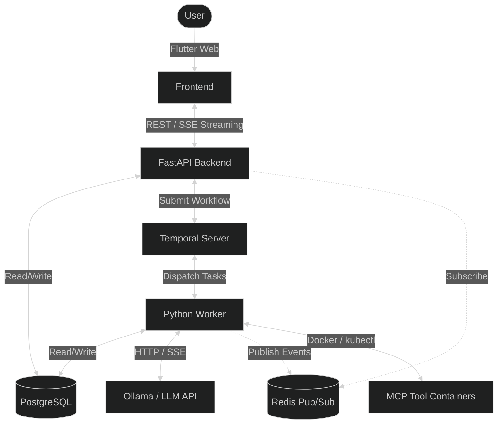
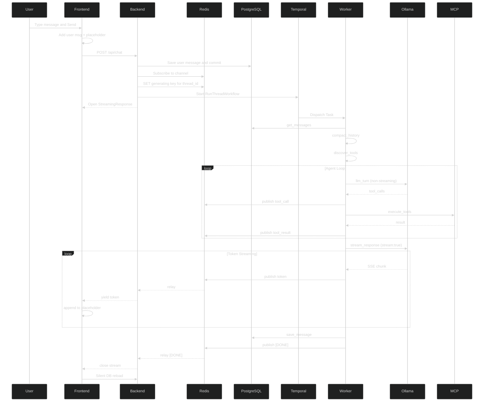

# Building a Thread-Based AI Chatbot With Temporal, Dockerized MCP, and Ollama <span style="opacity:0.5;margin:0;padding:0;font-size:14px;">- April 30, 2026</span>

Most AI chatbot applications share a simple pattern: send a message, wait, get a response. But what happens when that response takes thirty seconds because the agent is calling five different tools? What happens when the user refreshes the page mid-generation? What happens when you need the conversation to remember every tool call across turns?

This post covers ThreadBot, a full-featured, thread-based AI chatbot built on **[Temporal](https://temporal.io/)** for durable workflow orchestration, Dockerized **[MCP](https://modelcontextprotocol.io/)** for extensible tool support via [Docker's MCP catalog](https://hub.docker.com/mcp), and **[Ollama](https://ollama.com/)** for self-hosted LLM inference.

The key technical problems this addresses are:

* **Durability** - [Temporal](https://temporal.io/) workflows keep conversations alive across code crashes, deploys, and node drains without losing state or streaming progress
* **Extensibility** - Runtime tool discovery via MCP means new capabilities can be added without touching the code, and per-thread tool overrides let users enable or disable individual tools conversationally **Self-Hosted AI** - Ollama (or any OpenAI-compatible backend) provides inference without sending sensitive data to third-party APIs or draining your wallet
* **Context Management** - Automated, token-aware compaction of older conversation history to stay within LLM context window limits

<hr>

## TL;DR

The full source code is on my GitHub [here](https://github.com/GethosTheWalrus/thread-bot). You can get the entire stack running locally with a single command:

```bash
docker compose up --build
```

<hr>

## Why Temporal for Agentic Workflows?

Building an AI agent that calls tools, chains multiple LLM turns, and streams responses back to a user is fundamentally an orchestration problem. That is exactly what Temporal was built for.

Consider what happens during a single message exchange: the agent calls three tools sequentially, results come back, the agent makes two more tool calls, and finally it streams a 2000-word response token by token. This whole process can take 30 to 60 seconds. Without durable execution, a single worker crash or network blip means losing everything.

Temporal addresses this by providing durable execution with event replay. The workflow code runs as regular Python, but Temporal records every step in an event history and checkpoints state between activities. If the worker crashes during tool execution, Temporal replays that history and resumes exactly where it left off. No state is lost, no tool calls are duplicated, and the user never sees a timeout.

This matters especially for agentic workflows where:

- **Streaming takes time.** An LLM chat request cannot always be feasibly held open on a single HTTP connection. Temporal's workflow model decouples execution from delivery, allowing the agent's response to process in the background and appear on the UI when ready, like magic.
- **Multi-step reasoning requires state.** The agent loop (`llm_turn` → `execute_tools` → repeat) needs to survive interruptions mid-iteration. Temporal's event history is the source of truth.
- **Production deployments are disruptive.** Rolling updates, node drains, and autoscaling happen constantly. With Temporal, workflows continue across deployment boundaries.

<br>

Most developers reach for message queues or manual retry logic when building agents. Temporal replaces all of that with a single programming model where your workflow *is* the orchestrator. It's the difference between building a house of cards and pouring concrete.

## What Is Temporal?

[Temporal](https://temporal.io/) is an open-source platform for durable workflow execution. Think of it as a state machine that never forgets: your code runs as a workflow, Temporal records every step in an event history, and if a worker crashes mid-execution, Temporal can replay that history and resume exactly where it left off.

For a chatbot, this is non-negotiable. A single message exchange can take tens of seconds: the agent calls tools, those tools query databases or run commands, results come back, the agent calls more tools, and finally it streams the answer. Without Temporal, a worker crash during tool execution means losing everything. The user gets a timeout, the tool calls that already happened are forgotten, and the conversation dies. With Temporal, the workflow survives, the event history captures every step, and the streaming continues seamlessly.

Temporal workflows are written as regular code, but they execute with **durable execution**: Temporal checkpoints state between every activity, so there's no in-memory state to lose. This is what makes it practical, if not necessary, for long-running, multi-step conversations.

<hr>

## The Architecture

ThreadBot consists of several components, each solving a distinct problem:

<br>



<br>

The **Frontend** is a Flutter Web SPA that handles message sending, token streaming, markdown rendering, and the conversation tree UI.

The **Backend** is a FastAPI service that acts as the gateway between the frontend and Temporal. It creates threads, persists messages, submits workflows, and critically, subscribes to Redis pub/sub channels to relay streaming events to the frontend.

The **Worker** is a separate Python process that runs the Temporal worker. It fetches conversation history, runs token-aware compaction, discovers MCP tools, executes the agent loop, streams the final response, auto-generates thread titles, and publishes completion signals.

**Redis** bridges the gap between the worker and backend. Since they run as separate containers, the worker publishes streaming events to Redis pub/sub channels, and the backend subscribes to relay them. Redis also buffers events in lists for stream reconnect after page refresh and tracks generation status.

**PostgreSQL** stores everything: threads, messages, MCP server configurations with encrypted secrets, per-thread tool overrides, cached tool definitions, and persistent settings.

**Ollama** (or any OpenAI-compatible API) provides the inference layer. LLM configuration is managed server-side through the Settings screen and persisted in the database.

<hr>

## The Agent Loop

The heart of ThreadBot is the `RunThreadWorkflow` workflow, which orchestrates a message exchange through a carefully ordered sequence of steps:

1. **Fetch messages** - Loads and formats conversation history from the database
2. **Compact history** - Checks if conversation size exceeds the context window threshold; if so, summarize older messages and replace them with a system message
3. **Discover tools** - Discovers and filters available MCP tools for the thread
4. **Agent loop** - Alternates between `llm_turn` (for non-streaming LLM calls) and `execute_tools` (for tool execution) until the LLM returns text
5. **Stream response** - Re-issues the final LLM call with `stream: true` and streams tokens to the frontend
6. **Save response** - Persists the final assistant message to the database
7. **Auto-title** - Generates a thread title on the first exchange and every 5th message
8. **Publish done** - Sends a completion signal to close the stream

The agent loop is implemented as three discrete Temporal activities: `llm_turn` (single non-streaming LLM call), `execute_tools` (MCP tool execution), and `stream_response` (final streaming call). This decomposition gives each step its own activity with independent states, timeouts, and retry policies.

Here's how the loop works:

1. `llm_turn` calls the LLM with the conversation history and available tools. It returns `has_tool_calls`, `llm_message`, `tool_calls`, `thinking_content`, and `text_content` fields.
2. If the LLM returns tool calls, the workflow dispatches `execute_tools`, which spins up ephemeral MCP containers and executes each tool. Tool results are returned as tool messages to append to the LLM context.
3. Steps 1-2 repeat until `llm_turn` returns `has_tool_calls: false`
4. `stream_response` re-issues the final LLM call with `stream: true` and publishes each SSE token to Redis for frontend streaming

The loop is capped at 25 iterations by default, preventing runaway tool usage.

<details style="margin:20px 0;">
<summary style="background:#2d3748;color:#e2e8f0;padding:8px 12px;border-radius:6px 6px 0 0;font-family:'SF Mono',Monaco,'Cascadia Code','Roboto Mono',Consolas,'Courier New',monospace;font-size:13px;border:1px solid #4a5568;border-bottom:none;cursor:pointer;display:flex;justify-content:space-between;align-items:center;">
<span>{} RunThreadWorkflow - the orchestrator activity chain</span>
<span style="opacity:0.6;font-size:11px;">Click to expand</span>
</summary>
<div style="background:#1a202c;border:1px solid #4a5568;border-radius:0 0 6px 6px;margin:0;padding:0;overflow:hidden;">
<div style="background:#2d3748;color:#e2e8f0;padding:4px 12px;border-bottom:1px solid #4a5568;display:flex;justify-content:space-between;align-items:center;">
<span>Python</span>
<span style="opacity:0.6;font-size:11px;">app/workflows/thread_workflow.py</span>
</div>

```python
@defn.workflow
class RunThreadWorkflow:
    @run
    async def run(self, input: ChatInput) -> dict:
        thread_id = input.thread_id or str(uuid4())

        # Step 1: Fetch conversation history
        messages = await execute_activity(
            get_messages, thread_id,
            start_to_close_timeout=timedelta(seconds=10),
        )

        # Step 2: Compact if needed
        compact_result = await execute_activity(
            compact_history,
            {"messages": messages, "llm_config": llm_config, ...},
            start_to_close_timeout=timedelta(seconds=120),
            retry_policy=RetryPolicy(maximum_attempts=2),
        )

        # Step 3: Discover MCP tools
        tools_result = await execute_activity(
            discover_tools,
            {"thread_id": thread_id, "tool_overrides": tool_overrides},
            start_to_close_timeout=timedelta(seconds=120),
            retry_policy=RetryPolicy(maximum_attempts=2),
        )

        # Step 4: Agent loop
        current_messages = list(messages)
        for iteration in range(1, max_iterations + 1):
            turn_result = await execute_activity(
                llm_turn,
                {"messages": current_messages, "llm_config": llm_config,
                 "openai_tools": tools_result["openai_tools"], "iteration": iteration},
                start_to_close_timeout=timedelta(seconds=300),
            )

            if turn_result["has_tool_calls"]:
                current_messages.append(turn_result["llm_message"])
                exec_result = await execute_activity(
                    execute_tools,
                    {"tool_calls": turn_result["tool_calls"],
                     "mcp_tools_map": tools_result["mcp_tools_map"],
                     "llm_message": turn_result["llm_message"],
                     "llm_config": llm_config, "iteration": iteration},
                    start_to_close_timeout=timedelta(seconds=300),
                    retry_policy=RetryPolicy(maximum_attempts=2),
                )
                current_messages.extend(exec_result["tool_messages"])
            else:
                # Final response - stream it
                stream_result = await execute_activity(
                    stream_response,
                    {"messages": current_messages,
                     "llm_config": llm_config,
                     "fallback_content": turn_result["text_content"]},
                    start_to_close_timeout=timedelta(seconds=600),
                )
                llm_response = stream_result["content"]
                break

        # Step 5: Save final response
        await execute_activity(
            save_message,
            {"thread_id": thread_id, "role": "assistant", "content": llm_response},
            start_to_close_timeout=timedelta(seconds=10),
        )

        # Step 6: Auto-title (first exchange or every 5th message)
        # Step 7: Signal completion
        await execute_activity(publish_done, {...})

        return {"thread_id": thread_id, "response": llm_response}
```

</div>
</details>

<hr>

## Token Streaming With Redis

Streaming is a core component of a good user experience with chatbots like ThreadBot. When the LLM generates a response, tokens arrive one at a time and are pushed to the UI progressively. Here's how it works:

1. The user sends a message.
2. The backend creates the user's message in the database, subscribes to a Redis pub/sub channel, sets a `generating:{thread_id}` flag in Redis, and starts the Temporal workflow.
3. The worker's `stream_response` activity streams SSE tokens from the LLM API. Each token is published to Redis as a structured JSON event: `{"type":"token","content":"..."}`.
4. The backend's `StreamingResponse` relays these events to the frontend via a chunked HTTP response.
5. The frontend parses each event and appends the token to the placeholder message. The markdown renderer progressively displays the growing text.
6. When the workflow completes, a `[DONE]` signal closes the stream. The frontend does a silent reload from the database to replace temp messages with persisted ones.

But there's a twist: what if the user refreshes the page mid-generation? The Redis pub/sub connection is gone. ThreadBot solves this with **stream reconnect**:

1. The frontend detects `is_generating: true` in the thread response (checked via the `generating:{thread_id}` Redis key)
2. It connects to `GET /api/threads/{id}/stream`, which polls the Redis event buffer list (`events:{channel}`)
3. All buffered events replay from the beginning, rebuilding the conversation with thinking blocks, tool chips, and streaming tokens
4. New events continue to arrive via polling until `[DONE]`

Redis pub/sub doesn't buffer messages, so the event buffer list is critical - it's a Redis list that stores every event for a 60-second reconnect grace period after completion.

<details style="margin:20px 0;">
<summary style="background:#2d3748;color:#e2e8f0;padding:8px 12px;border-radius:6px 6px 0 0;font-family:'SF Mono',Monaco,'Cascadia Code','Roboto Mono',Consolas,'Courier New',monospace;font-size:13px;border:1px solid #4a5568;border-bottom:none;cursor:pointer;display:flex;justify-content:space-between;align-items:center;">
<span>{} Event types published to Redis</span>
<span style="opacity:0.6;font-size:11px;">Click to expand</span>
</summary>
<div style="background:#1a202c;border:1px solid #4a5568;border-radius:0 0 6px 6px;margin:0;padding:0;overflow:hidden;">
<div style="background:#2d3748;color:#e2e8f0;padding:4px 12px;border-bottom:1px solid #4a5568;display:flex;justify-content:space-between;align-items:center;">
<span>JSON</span>
<span style="opacity:0.6;font-size:11px;">Structured event format</span>
</div>

```json
{ "type": "thinking",    "content": "Let me check the database..." }
{ "type": "tool_call",   "content": "Running query", "tools": ["query_db"], "tool_calls": [...] }
{ "type": "tool_result", "tool": "query_db", "content": "42 rows returned", "success": true }
{ "type": "token",       "content": "The" }
{ "type": "token",       "content": " answer" }
{ "type": "token",       "content": " is" }
{ "type": "token",       "content": " 42." }
{ "type": "title",       "content": "Answer to Life" }
```

Plain string sentinels `[DONE]` and `[ERROR]` mark stream completion and errors respectively.

</div>
</details>

<hr>

## Dockerized MCP Tool Support

ThreadBot extends the LLM's base capabilities with custom tools via [MCP](https://modelcontextprotocol.io/). Dockerized MCP-compatible tool servers run as ephemeral containers. The LLM discovers tools at runtime, calls them, and receives results, all managed by the agent loop.

### Tool Discovery

When the user adds an MCP server in the UI, ThreadBot stores the configuration. On first chat or when the user clicks "Test Connection", ThreadBot spins up a temporary container, performs the MCP handshake, and returns the tool catalog. Discovered tools are cached in the `cached_tools` JSONB column, so ongoing tool management doesn't slow down the UI.

### Per-Thread Overrides

Users can enable or disable individual tools or entire MCP servers on a per-thread basis via a wrench icon in the chat input. Overrides are stored in the `thread_tool_overrides` table. Tool-level overrides take precedence over server-level overrides. No override rows means all tools are enabled. This allows you to easily control context consumed by tool descriptions in each thread.

### Execution

When the agent calls a tool, the worker launches the corresponding container. Tool results are fed back into the LLM context, and the loop continues.

<hr>

## Persistent Tool Memory

Unlike some chatbot implementations that discard tool call details after the response, ThreadBot persists every `tool_call` and `tool_result` as distinct message roles in the database. This means the LLM retains "tool memory" across conversation turns - if you ask about a tool result from five messages ago, the model can still see it.

The `get_messages` activity reconstructs the OpenAI-compatible message format: `assistant` role messages with embedded `tool_calls` arrays, paired with `tool` role messages for results. `thinking` role messages are skipped during reconstruction since they're display-only.

This persistent tool memory is what makes multi-step, multi-turn conversations with tools practical. The model never loses track of what it already did.

<hr>

## Conversation Memory and Compaction

Long conversations eat up LLM context windows. ThreadBot implements **token-aware compaction** to manage this:

Before every LLM call, the conversation history is analyzed using a character-count heuristic. If the estimated token count exceeds a configurable percentage of the context window (default 75%), compaction triggers:

1. Older messages (excluding a configurable "preserve recent" buffer, default 10) are sent to a separate non-streaming LLM call for summarization
2. The original messages are deleted from the database and replaced with a single `system` role message containing the summary
3. This summary becomes the first message in subsequent turns, providing context without consuming the full token budget

<hr>

## The User Interface

The Flutter web frontend delivers a thread-based conversation interface with real-time streaming. The architecture uses three screens: the chat screen, the settings screen, and the MCP server management screen.

The UI renders messages with markdown support and distinguishes between different message types: user messages, assistant responses, thinking blocks, tool call chips, and tool results. Each tool call chip shows per-chip animation that stops when its result arrives, with expandable sections revealing tool input and output. Assistant messages include a compact horizontal response timeline showing thinking, tool calls, and results with animated progress indicators.

Stream reconnect is seamless - if the user refreshes mid-generation, the frontend detects the active generation flag in Redis, reconnects to the event buffer, and replays all buffered events, rebuilding thinking blocks, tool chips, and streaming tokens. The user barely notices.

<br>



<br>

<hr>

## Infrastructure: Docker Compose to Kubernetes

ThreadBot is designed to run anywhere. The development experience uses Docker Compose. Everything starts with `docker compose up --build`.

Kubernetes manifests are also provided in case you have existing infrastructure.

The K8s deployment includes:
- Backend and Worker deployments
- Frontend served via nginx
- A dedicated nginx proxy with a LoadBalancer service for routing
- RBAC for MCP pod management
- A CronJob for cleaning up completed/failed MCP pods every 15 minutes

<hr>

## What Makes This Powerful

Threadbot demonstrates how developers can utilize Temporal to reign in a web of non-deterministic LLM calls and turn them into something production-ready.

### Self-Hosted and Private

Self-hosted inference via Ollama means sensitive data such as conversation content, tool results, and internal topology never leaves your infrastructure. The LLM backend is pluggable and configurable: swap between Ollama and any OpenAI-compatible backend with a config change, not a code change.

### Extensible by Design

MCP means ThreadBot's capabilities grow without code changes. Add a new MCP server through the UI, and the LLM immediately discovers and can use its tools. Per-thread overrides let different conversations use completely different tool sets.

### Durable by Default

Temporal means conversations survive infrastructure failures. Worker crashes don't lose state. Node drains don't interrupt streams. Deployments don't drop in-progress generations. The workflow history is the source of truth.

<hr>

## Wrapping Up

ThreadBot is proof that building robust, production-ready AI applications is achievable with the right infrastructure. Temporal handles the orchestration complexity, MCP provides a plugin architecture for tools, Ollama delivers private self-hosted inference, Redis enables real-time streaming, and Flutter delivers a premium cross-platform interface.

The combination of these technologies creates a chatbot that doesn't just respond based on its training data; it reasons, executes, remembers, and streams.

Want to see the code behind ThreadBot? Check out the full repository [here](https://github.com/GethosTheWalrus/thread-bot) with Docker Compose setup and Kubernetes manifests.

Want to read more about Temporal and some of what I've build with it? Check out some of my other blog posts:
* [Building an agentic home lab automation app](https://miketoscano.com/blog/agentic-devops-infrastructure.html)
* [Controlling your Temporal server install with AI](https://miketoscano.com/blog/docker-mcp-temporal.html)
* [Running LangChain agents inside of a Temporal workflow](https://miketoscano.com/blog/langchain-temporal-workflow-processor.html)

<br>

*Have you built something with Temporal and MCP? I'd love to hear about your experiences. Reach me at [mike@miketoscano.com](mailto:mike@miketoscano.com) and share your workflows!*
